# O 个人云电脑、本地协同与 Web / PWA 手机入口方案

> 历史方案：本文保留早期双节点设计。当前统一设计为一台云端电脑、N 台独立本地节点、GitHub/Gitee 仓库优先及 500MB 传输分批策略（不限制本地项目或任务），见 [O 云端优先完整方案](o-cloud-first-architecture.md)。与本文冲突时，以新版为准。

日期：2026-10-01。版本：v3。依据用户最新决定，手机入口采用 Web / PWA，同时支持 Android 和 iPhone；持久云电脑、共享会话与产物目标保留。状态：架构提案，Web 基础已进入本地开发，尚未部署或验证远程连接。

## 1. 目标与已知条件

目标是让同一个长期存在的个人 O 使用本地和云端两台电脑：有一台专属、持久的 Linux 云电脑，能浏览网页、写代码、安装工具、运行后台任务；同一会话在本地和云端之间切换执行；手机 App 可以向两台电脑发起任务，查看共享会话、进度与产物。

用户提供的云服务器配置：4 核 CPU、4GB 内存、40GB 系统盘、Ubuntu 26、峰值带宽 1000M、月流量 350GB。Ubuntu 小版本、CPU 架构、虚拟化能力、实际可用磁盘、流量计费口径和现有服务尚未核验。本地暂按 Windows 设计。带宽暂按 1000Mbps 理解，以服务商控制台为准。

首版面向一个用户及其设备。并发采用资源调度，区分模型/API 等待、普通文件任务、浏览器和重计算，不把所有任务统一限制为一个。云电脑生命周期独立于会话和任务；完成一个任务不会清空系统、工具、文件或浏览器配置。模型仍通过现有 Provider API 调用。项目同步默认只包含选定目录；凭据分别保管。手机明确同时支持 Android 和 iPhone。

本文不包含服务器密码。实施前使用独立 SSH 密钥，并轮换已在聊天中提供的登录密码；不把登录凭据放入仓库、启动参数或日志。

## 2. 当前代码基础与实际缺口

以下是本次工作区源码检查结果，不代表已通过 Linux 部署验证：

| 现有结构 | 可以复用的能力 | 需要补充的能力 |
| --- | --- | --- |
| `backend/cmd/axiom/main.go` | Go Host、组件装配、进程信号处理、启动恢复 | 独立常驻模式、节点身份、云端 Worker 接入 |
| `backend/internal/config/config.go` | `O_ADDR`、数据目录、工作目录，默认监听 `127.0.0.1:9171` | 云控制地址、节点证书、运行角色及共享校验 |
| `backend/internal/httpapi/server.go` | 对话、提交任务、取消、审批、持久化事件 SSE | 真实请求身份、工作区鉴权、设备范围、CSRF 防护 |
| `backend/internal/storage/sqlite.go` | 本机 SQLite WAL、事务、持久化设置 | 全局 ID、同步 outbox/inbox、版本冲突及云端仓库接口 |
| `backend/internal/agent/service.go`、`runjournal.go` | 执行循环、事件记录、队列、部分检查点和中断恢复 | 单任务执行归属、租约、跨节点交接、成果提交协议 |
| `desktop/main.cjs` | Electron 启动本地后端及提供 API 地址 | 桌面退出后可继续运行；连接已有 Host，避免重复实例 |
| `frontend/app/api.ts` | HTTP API 与 SSE 客户端基础 | 共用 TypeScript SDK、云端同源请求、登录会话、位置选择、节点及同步状态 |
| `backend/internal/sandbox/process_other.go` | 非 Windows 默认拒绝无沙箱执行 | Linux 执行后端及全工具路径隔离 |

两个必须提前解决的限制：

1. 当前 HTTP 中间件主要是 CORS、日志及错误恢复；工作区由 Host 固定绑定。CORS 不等于身份认证，不能将这个接口原样公开到互联网。审批也需要从认证上下文取得操作者身份。
2. 当前非 Windows 命令执行路径明确返回 `ErrUnavailable`。Go 后端能否编译、启动，与 Agent 能否在 Linux 正常执行命令是两回事。不能通过关闭沙箱或改成裸 `exec` 来实现云端执行。

## 3. 总体结构

采用“同一个个人 O 的会话和产物中心 + 本地执行电脑 + 持久 Linux 云电脑 + Android/iOS 客户端”。会话、任务和电脑不是一对一绑定：一个会话可有多个任务，同一台云电脑可承载多个会话和后台任务。每次运行明确执行位置；初期完整复用现有 Agent 循环，不将一次循环拆成跨机器工具 RPC。

```mermaid
flowchart TB
    Client["Android / iPhone / 浏览器 / O 桌面"] -->|"HTTPS，用户登录"| Edge["云端入口与 Web UI"]
    Edge --> Control["O Control：身份、设备、任务、同步"]
    Control --> DB["云端 PostgreSQL：共享状态"]
    Control --> Files["成果文件与版本清单"]
    Local["本地 O Host：本机 SQLite 与工作目录"] -->|"主动连接：首版反向 SSH，后续 WSS"| Control
    Control -->|"任务派发与控制"| Local
    Control -->|"派发与资源调度"| Worker["云电脑 Supervisor"]
    Worker --> Sandbox["持久 Linux 运行区：O、浏览器、工具、项目"]
    Sandbox -->|"事件与成果，经 Supervisor 校验"| Control
```



云端控制服务负责登录、设备配对、任务归属、持久化调度、事件聚合和同步；执行电脑负责实际 Agent 循环和工具执行。个人云电脑内可以由同一个 Agent 使用已授权项目及工具；宿主控制服务、数据库管理凭据、SSH 管理密钥和凭据代理位于运行区之外。

共享会话使用稳定的全局 conversation ID，云端控制数据库保存权威共享日志，本地 SQLite 保存副本、检查点和 outbox。界面展示同一个会话，而不是“本地会话列表”和“云端会话列表”两套复制品。只在本地保密的会话保持本地权威、不上传。离线共享会话的新内容基于明确的 base revision，出现并行修改时保留并展示分支，不静默覆盖。

## 4. 第一部分：远程控制本地 O

### 4.1 连接方式

本地电脑主动连接云服务器，适配家庭内网、动态 IP 和常见 NAT。远程客户端只访问云端 HTTPS 入口。

首版选择反向 SSH，直接使用现有服务器，不依赖另外的组网账户。链路为：

```text
远程客户端 → HTTPS 登录网关 → 云端 loopback 端口
          → SSH 加密隧道 → 本地 Remote Bridge → 本地 O API
```

Remote Bridge 检查用户、设备、工作区和路由权限，再调用只监听本机的 O API。不能让网关透明转发所有管理接口。首版开放对话读取、提交、事件、取消、审批和选定成果下载；安装插件、沙箱维护和节点管理需要单独管理权限。

隧道只转发 Bridge；下列是待实施时填写的示意配置，不是已经建立的连接：

```text
ssh -NT -o BatchMode=yes -o ExitOnForwardFailure=yes \
    -o ServerAliveInterval=30 -o ServerAliveCountMax=3 \
    -R 127.0.0.1:19171:127.0.0.1:9172 <tunnel-user>@<cloud-host>
```

这里暂约定 Bridge 为本地 `9172`，现有 O API 仍为 `9171`；端口必须在实现时统一配置和验证。建立隧道后还要完成应用认证和一次真实任务验证，SSH 进程存活不能作为“远程控制可用”的判据。

服务端为隧道创建专用低权限账户和独立密钥；限制 `AllowTcpForwarding remote`、`PermitListen 127.0.0.1:19171`、`GatewayPorts no`，禁用 TTY、SSH agent/X11 转发和 shell/subsystem 会话（例如单独账户 `MaxSessions 0`）。先验证管理密钥和恢复入口，再关闭旧密码登录。核对服务器 host key，不关闭 host key 检查。[OpenSSH 端口转发](https://man.openbsd.org/ssh)、[服务端访问限制](https://man.openbsd.org/sshd_config)。

产品化阶段将 SSH 隧道替换为设备主动发起的 HTTPS/WSS 连接，使用设备证书、心跳、重连、命令确认和事件游标。用户不必配置 SSH。SSH 继续用于服务器运维。若希望先获得私有网络访问，可用 Tailscale 替代隧道传输：它提供 NAT 穿透及加密中继，但应用认证仍需保留。[Tailscale 连接说明](https://tailscale.com/docs/reference/connection-types)。

### 4.2 本地常驻与桌面操作

本地 Host 需要由独立守护进程或启动任务管理，保存既有数据目录，且只有一个进程拥有同一 SQLite 和工作区。Electron 连接该 Host；保留明确的“仅随桌面运行”模式。迁移时完成旧 Host 停止与新 Host 接管再回读版本，不能两份 Host 同时执行。

首版优先支持用户登录后常驻的任务执行；开机未登录也要跑命令时，增加 Windows 服务模式及对应账户、目录 ACL 和凭据访问设计。

“控制 O 的任务”与“操作 Windows 桌面”是两种能力。GUI、已有浏览器窗口、Office 等需要用户会话内的助手，通过受限 IPC 连接 Host；服务本身不能假定可以直接操纵交互桌面。未登录、锁屏及 GUI 工具不支持时显示具体能力不可用。SSH 连接不意味着获得 GUI 自动化能力。[Microsoft 服务与交互桌面说明](https://learn.microsoft.com/en-us/windows/win32/services/interactive-services)。

电脑关机或睡眠时，本地任务不能执行。针对本地资源的请求保留在明确的离线队列，设置可见的过期规则；不会静默改到云端。断开客户端连接不取消已启动任务。

## 5. 第二部分：Muse 风格的持久 Linux 云电脑

本次参考的是 Meta 2026 年 9 月发布的个人 Agent Muse。官方描述其运行在用户专属的 Linux 云电脑上，具备浏览器并承载并发子任务；公开技术资料将 Agent 运行区与敏感服务分开，并使用持久数据库。这里借鉴公开结构，不承诺复现 Muse 的完整安全机制或未公开实现。[Muse 产品介绍](https://about.fb.com/news/2026/09/introducing-muse-personal-ai-agent/)、[Muse 技术说明](https://research.meta.ai/blog/security-and-safety-for-ai-agents-our-approach-with-muse)。

### 5.1 生命周期和隔离边界

一台持久云电脑拥有一个 computer ID、Linux 根文件系统、主目录、项目和工具环境；重启后从持久磁盘恢复。会话只是 O 的交流记录，任务只是电脑上的工作单元，不创建和销毁整台电脑。

首版优先验证 `systemd-nspawn` 持久运行区：独立 Linux rootfs、用户命名空间、私有网络、系统调用/capability 限制；运行区内的管理员权限映射到宿主非特权身份。Agent 可在自己的 Linux 环境安装软件及操作文件，不能取得承载控制服务的宿主 root、数据库管理员凭据或 SSH 管理密钥。初始化需要具体检查 Ubuntu 内核和 systemd 支持。[systemd 官方手册源码](https://github.com/systemd/systemd/blob/main/man/systemd-nspawn.xml)。

持久运行区与同用户的并发任务共享个人电脑边界；任务目录、进程组和浏览器上下文主要提供调度、避免干扰及恢复能力，不能当作恶意任务之间的强隔离。运行不可信第三方代码或未来多租户时，另设独立隔离执行环境。需要附加系统调用隔离时再验证 gVisor；具备 `/dev/kvm` 时可评估 microVM，均不改变持久电脑的产品生命周期。[gVisor 安全模型](https://gvisor.dev/docs/architecture_guide/security/)。

控制、权限、密钥代理、成果提交和数据备份服务在运行区外。出口代理允许正常联网，但阻止 metadata、未授权内网和宿主管理接口。HTTP、浏览器、终端和其他工具均经过实际网络限制，不能仅约束内置 fetch。Agent 不能修改运行区外的审批政策；软件安装先写入可回滚的电脑版本记录，验证后激活，失败保留旧版本或明确故障状态。

Linux 命令适配仍需要实现：`runProcessTree` 必须确认自己在健康运行区中，通过受控执行代理创建有任务归属的进程。文件、脚本、插件和浏览器也在运行区内，不允许某个工具落回宿主裸执行。

### 5.2 多任务运行流程

1. 持久化会话输入、任务、执行电脑与文件版本；返回 `queued`。
2. Supervisor 检查电脑健康、输入、凭据、资源及可写项目锁。
3. 为任务分配工作目录或 Git worktree、进程组、浏览器页面及资源额度，不重建 Linux 系统。
4. 复用 O Runtime 和已安装工具；模型等待与本地计算分别占用调度额度。
5. 写入有序运行事件；高风险工具调用等待精确审批。
6. 正常最终答复与输出提交后，控制服务读回事件和成果清单，发布完成状态。
7. 回收任务临时文件和进程，保留电脑、工具、授权浏览器配置、项目及已提交成果。

同一个会话默认只有一个写入执行者；独立会话和任务可并发。多个任务写同一项目时用独立 worktree 或排他写锁；只读任务可并发。不同 worktree 的输出以 patch 合并，不自动覆盖主目录。

### 5.3 浏览网页、长期环境和浏览器接管

云电脑安装 Node、Python、Git、Shell、Chromium 和 Playwright，由 O 的浏览器工具导航、读取页面、截图、点击、填表、下载及上传。Agent 可以逐步安装工具、开发技能和运行经授权的后台服务。

浏览器服务按需启动，复用受管理的浏览器进程与多个 context/page。无登录任务可用独立 context；长期登录按 profile 管理，每个持久 profile 只由一个浏览器实例拥有，不能多个进程同时打开同一 user-data 目录。同一页面的导航、点击和用户接管互斥。Context 提供网页状态分离，不是操作系统级隔离。[Playwright Context](https://playwright.dev/docs/browser-contexts)、[持久浏览器配置](https://playwright.dev/docs/api/class-browsertype#browser-type-launch-persistent-context)。

手机或桌面可查看经过认证代理传递的截图/画面及操作过程；首版支持浏览器级接管，完整 Linux 桌面按需启动轻量桌面和远程画面服务。CDP、VNC 等管理端口不直接公开，用户接管时暂停 Agent 对相同页面的写操作，退出后明确交还控制。

浏览器 profile 属于该执行电脑，默认不双向复制 cookie。首版不能宣称 Agent 对所有登录秘密不可见：开放 shell 与普通浏览器 profile 可能接触登录状态，若要达到 Muse 式凭据隔离，需要独立凭据代理和受控浏览器边界。网页查看和浏览器画面是首版云电脑体验的一部分，不仅仅提供终端。

## 6. 数据互通：按数据性质设计

不用 rsync、网盘或共享磁盘同时同步正在写入的 `axiom.db`、WAL、凭据库。运行中数据库文件复制也不能当作一致性备份。SQLite 官方说明了网络文件系统同步与锁定带来的可靠性风险。[SQLite 网络使用说明](https://www.sqlite.org/useovernet.html)。

| 数据 | 首版策略 | 冲突和完成判据 |
| --- | --- | --- |
| 对话消息、任务事件 | 同一 conversation ID 和共享日志，全局 ID，增量追加 | 去重、有序游标；目标库事务提交后才确认接收 |
| 共享任务及运行归属 | 控制数据库单一调度权威 | CAS 版本检查；每次执行有独立 attempt 和租约 |
| 项目目录位置 | 同一 project ID 对应各节点路径 | Windows 路径与 Linux 路径分别映射，不复制绝对路径 |
| 项目代码 | Git commit/branch/patch + 上传必要的未提交内容 | 运行基于固定输入版本；输出为分支/patch，冲突显式处理 |
| 附件、图片、文档等成果 | 同一 artifact ID，哈希寻址、版本清单、分块传输 | 显示各电脑文件可用性；下载后校验，冲突不覆盖 |
| 项目设置、记忆 | 明确选择共享的字段，带 revision 和来源 | 不用机器时钟判定最后写入；可变冲突要求选择版本 |
| Agent/技能/插件 | 固定发布版本和内容哈希 | 节点需安装验证和健康回读；发布不等于运行可用 |
| API 密钥、SSH 私钥、浏览器 cookie | 默认保留在原节点 | 只同步“该节点是否具备所需凭据”，不复制密钥文件 |
| 缓存和环境 | `node_modules`、虚拟环境、构建目录等不常规同步 | 使用锁文件和镜像版本重建；特殊需求显式打包 |

目录上传采用 allowlist，默认排除 `.env`、私钥、凭据目录、大型缓存及内部数据目录；明确显示哪些文件会离开本机。若用户明确要同步某类密钥，另行设计设备授权和接收节点重新加密，不能直接复制本地 vault。

同步在源库事务中同时写业务记录和 outbox；网络发送可重复，目标通过 inbox 去重后事务提交，再回传游标。网络中断保留待发送记录；源节点只有收到持久化确认才推进游标。定义同步协议版本、保留期和全量快照回退；旧客户端不得静默丢弃未知字段。

传输保证“至少一次 + 幂等去重”；对产生外部副作用的工具不承诺通用 exactly-once。同步重试不能变成再次执行工具。

默认共享数据经 TLS 传输，云服务能读取这些数据用于调度、检索和执行。这不是对云服务不可见的端到端加密。敏感项目可选择“仅本地”；若增加不透明端到端加密存储，该数据的云端搜索及执行能力要相应限制。

离线本地任务使用独立 ID/分支及节点权威记录，联网后增量同步。云端管理的运行不因断网变成本地自由执行的同一个运行。权限提高、插件激活等管理变更不离线自动合并。

## 7. 调度、断线和跨节点交接

每次运行固定 `execution_target=local:<computer_id>` 或 `cloud:<computer_id>`，对应 `task_id + attempt_id + node_id + lease_epoch`；conversation ID 不因位置切换而改变。首版会话顶部直接选择“本地电脑 / 云电脑”，也支持自然语言“接下来在云端继续”。后续自动选择基于可见能力与数据授权，在启动前展示位置。

能力匹配包括操作系统、工具版本、沙箱健康、项目输入版本及凭据可用性。需要 Windows Office 的任务不能自动派给 Ubuntu；需要本地私有文件的任务不能未经授权上传后改派云端。

界面状态来自持久化记录和运行确认，区分：

```text
queued → preparing → running ↔ awaiting_approval
running → committing_outputs → completed
running → cancel_requested → cancelled
任意非终态 → failed / interrupted / recovery_required / budget_exhausted
```

这些是拟新增的任务编排状态；现有 Turn 状态要有明确映射，保留原有正常答复、失败和预算终止的区别。用户指定执行预算需由共享契约定义并贯彻到运行路径；不新增隐式 Host 级总 token 或总时长上限。

设备连接状态、运行能力和同步进度分别命名：设备已配对不代表在线，在线不代表沙箱健康，任务完成不代表另一节点的成果已下载。显示最近心跳、健康原因、事件游标与待同步项。

派发命令必须可去重；取消先持久化 `cancel_requested`，节点停止相关进程并写入终态后才显示 `cancelled`。审批绑定认证用户、具体运行、工具参数和固定插件版本，仅一次有效；节点最后执行本地政策，不接受云端绕过本机最大授权范围。高风险动作可以要求本机再次确认。

租约必须由节点在执行前及执行期间检查，过期后阻止新工具调用并按协议停止在途工具。控制端拒绝旧 epoch 的写入。但 fencing 本身不能撤销已发生的本地文件或外部系统副作用，因此网络分区时不自动在第二个节点重跑原任务。

任务接管顺序：请求暂停 → 源节点确认停止并写检查点 → 检查无未确认工具调用 → 提交输入/成果版本 → 撤销旧归属 → 目标准备并读回 → 分配新归属 → 目标执行。中间失败停留在可恢复状态，不展示“迁移完成”。源节点不可达或外部副作用未知时，要求人工选择恢复路径。

首版交互目标是“同一会话一键切换电脑”：自动提交当前成果与检查点、同步所需版本、确认目标具备工具和文件，然后在原会话创建下一次运行。客户端显示 `switch_requested → source_paused → syncing → target_preparing → ready`；目标运行实际读到所需状态、且原归属已撤销后，才显示切换完成。离线目标保留待切换状态，缺失文件或依赖给出具体原因。

模型上下文从共享完整消息、工具记录、任务目标和检查点重建；provider 的 response ID、缓存和凭据可能与节点绑定，不能盲目搬运。重建若需要有损摘要，要记录并展示；不宣称内存、进程或 Windows/Linux 桌面会话原样迁移。浏览器页面以 URL/操作记录重新打开，登录态分别授权。

共享成果先在后台准备副本，切换只补缺失版本。例：云端查网页并生成方案，用户在手机看到同一会话和文件；切换本地后，指定本机目录中的文件下载并校验，O 用本地 Office 或项目环境继续编辑。电脑关闭时，手机仍可给云电脑发新任务；本地独有且未上传的输入不能在离线后凭空取得。

## 8. 4 核 4GB / 40GB / 350GB 的部署安排

### 8.1 首版组件

公网 HTTPS 入口和静态 Web UI、一个 Go 控制服务、一个 PostgreSQL 实例、一个 Supervisor、一个持久 Linux 运行区。用 systemd 管理宿主服务及 nspawn 电脑，数据库可采用宿主服务或受限容器。不引入 Kubernetes、Redis、独立 MinIO 集群和多个常驻浏览器实例。

持久化任务队列先用 PostgreSQL 事务实现，避免新增队列服务。初期成果使用宿主内容寻址文件目录，经控制服务授权访问；达到磁盘门槛后迁移到兼容 S3 的外部存储。单机数据库与文件存储不构成高可用。

建议容量预算是初始工程参数，需要测量后调整，不是当前实测：

| 项目 | 起步预算 |
| --- | --- |
| 系统和宿主基础服务 | 约 0.5–0.7GB 内存，需实测 |
| HTTPS 入口、Go 控制服务和 Supervisor | 约 0.15–0.25GB |
| PostgreSQL | 约 0.2–0.35GB |
| 持久电脑及其所有任务 | 初步合计约 1.8–2.2GB 预算，运行时按实测余量准入 |
| 安全余量 | 约 0.5GB 以上，避免 swap 掩盖长期内存不足 |

电脑总内存上限按实际 MemTotal、宿主服务实测占用和至少 0.5GB 余量计算，不能独立将各项都配到峰值后超出物理容量。运行区的总体 CPU/内存/PID 约束由宿主执行，内部任务额度辅助调度，不作为阻止恶意运行区管理员的强安全边界。

4 核不是最多四个任务，任务等待外部模型/API 时几乎不占本机 CPU；真正约束是活跃进程的峰值内存、CPU、网页复杂度和外部接口限流。下面是同类任务的初始准入目标，未做压测，不保证这些数字，也不能将各行直接相加：

| 工作类型 | 可先验证的并发目标 | 调度方法 |
| --- | --- | --- |
| 模型/API 等待为主的小任务 | 8–16 个活跃工作流 | 共用轻量 Runtime，限制实际同时在途模型请求，测量历史上下文内存 |
| 文件处理、HTTP 检索、轻量脚本 | 3–6 个 | 内存估算及 CPU 准入，复用工具环境 |
| 普通浏览器任务 | 2–3 个活跃页面任务 | 浏览器进程复用、上下文/页面锁；重网页自动降低并发 |
| 安装依赖、大项目构建、重计算 | 先允许 1 个重计算槽位 | 占用资源额度，仍可并行低成本任务 |

建议先将活跃工作流准入数配置为 8、浏览器活跃任务数为 2、重计算额度为 1，实际在途模型请求、总内存和 CPU 独立限制。正在等待用户的任务可释放计算槽位，但保留持久状态；4GB 机器上不保证八个工作流都能同时占满浏览器或构建资源。调度器使用已持久化的配置和版本，执行节点确认应用后 UI 才显示生效；随内存压力暂停新增资源申请，保护控制服务。

优先给交互任务资源，后台任务可排队。取消必须只停止归属该任务的进程/页面，不能杀死其他任务复用的浏览器。资源不足、OOM 和预算终止显示准确状态，不伪装完成。容量验收分别测试同类负载与混合负载，并测 p95 响应时间、峰值内存和失败率。

40GB 磁盘建议预算：宿主系统 10–12GB、持久 Linux rootfs 与工具 5–6GB、数据库 2GB、日志 1GB、项目及成果 5GB、临时区 4GB、保留空间至少 8GB。长期安装工具及浏览器缓存计入电脑配额；超额时暂停新增写入密集任务，不删除个人电脑来释放空间。实际可用空间不足则缩小预算。低于 8GB 可用空间时停止启动新增磁盘任务，保留控制、读取和安全清理能力。

350GB/月约为每 30 天平均 11.7GB/日。峰值链路速率不能代表可持续使用额度。先核对服务商按出站还是双向计费；以控制台计量为准，本机统计用于提前预警。建议总用量到 250GB 预警，300GB 暂停大文件自动同步与批量下载，保留交互控制；阈值作为后端持久化设置，并落实到传输路径。启用增量、去重、压缩和文件大小上限，默认不镜像整块本机磁盘。

外部对象存储、模型 API、额外快照/备份和超额网络费用另计。先使用已有服务器，不在未做容量测试时追加采购。

### 8.2 主机与网络边界

公网服务只开放 HTTPS 入口及受限管理/隧道 SSH；HTTP 若使用仅作证书验证或重定向。PostgreSQL、现有 O API、Worker 管理接口和反向转发端口不公开。容器映射和宿主防火墙一并核对，不能只检查一个防火墙开关。

实施前读取 Ubuntu 具体版本、架构、内核、可用磁盘和 Docker/gVisor 支持情况。Docker 官方目前已将 Ubuntu 26.04 LTS 列入支持表，仍需确认这台主机的具体版本和架构。官方安装支持表不覆盖该版本时不强行混用其他发行版的软件源；可选兼容包或经用户决定调整系统。[Docker Ubuntu 安装说明](https://docs.docker.com/engine/install/ubuntu/)。

## 9. 身份、安全与恢复

单用户版也需要登录：优先采用成熟 OIDC 身份入口或 passkey；会话 cookie 使用 Secure、HttpOnly、SameSite，管理变更校验 CSRF。首版不自制复杂密码账户体系。用户、工作区、设备和任务使用不同身份及授权范围。

设备通过短期、一次性配对码注册，密钥在设备本机生成；可撤销、轮换和查看最后连接。节点请求使用短期令牌或 mTLS；日志不记录配对码、凭据、原始工具参数和敏感内容。配对完成必须确认节点回读身份并以新凭据重新连接。

将云控制服务纳入信任范围；它被攻破可能暴露已授权的共享数据或尝试远程命令。通过本地权限上限、节点独立密钥和高风险本机确认缩小影响，不把 TLS 描述成能抵御云控制服务自身被攻破。

任务持久化事件保留诊断能力，运维日志只记录安全元数据；通过任务、节点、attempt 和请求 ID 关联。错误、同步失败、输出提交失败和清理失败均明确展示，不能吞掉异常。

备份覆盖 PostgreSQL 一致性备份、成果版本清单及已提交内容；先取得提交边界，再导出关联文件。数据库快照与任意时间复制文件的组合不能假定一致。备份加密并放到另一故障域，密钥独立保管，恢复时核对记录与文件哈希。单机 40GB 上的另一个目录不能代替异机备份。

首版建议每日异机备份，设计目标 RPO 24 小时、RTO 2 小时；这是待演练验证的目标。需要更低 RPO 再增加数据库 WAL 归档和及时成果备份。重启恢复不能自动重放结果未知的外部操作。

## 10. 建议代码改造边界与接口

新包/入口是提案，尚不存在：

- `backend/cmd/o-control`：云控制服务；首版复用 Go 领域契约与前端。
- `backend/cmd/o-worker`：持久电脑 Supervisor、资源调度、进程归属及成果提交。
- `backend/internal/remote`：设备配对、传输、认证、重连及 Bridge。
- `backend/internal/orchestration`：任务状态、归属、租约、调度及交接。
- `backend/internal/sync`：outbox/inbox、游标、对象版本与冲突。
- `backend/internal/sandbox`：Linux 后端、健康检查、回收与失败恢复。
- `backend/internal/storage`：保留本机 SQLite；抽取所需 repository 接口，为控制服务添加 PostgreSQL 实现。
- `frontend/app/api.ts` 及现有主界面：同源云 API、会话恢复、任务位置、能力和同步状态。
- `desktop/main.cjs`：连接现有常驻 Host、生命周期切换与单实例接管。
- `frontend/`：复用现有 Web 界面作为 Android / iPhone 的响应式 PWA 入口；桌面仍保留 Electron。原生 `mobile/` 仅作为未来可选项目。
- `packages/o-client/`：客户端身份、任务、会话、成果、重连游标和错误契约，共用于桌面、Web 与手机。

不直接把现有依赖 `*storage.Store` 的所有代码改成远程数据库调用。先抽取任务、事件、共享对象和认证所需接口；Agent 核心继续在执行节点使用本机事务存储。

拟新增接口：

| 接口 | 契约重点 |
| --- | --- |
| `POST /api/v3/device-pairings` | 发起短期配对，不等于设备已连接 |
| `GET /api/v3/devices` | 已注册身份、最后心跳、能力和健康分别返回 |
| `POST /api/v3/tasks` | 验证身份、输入与目标，持久化后返回 `queued`；幂等键 |
| `GET /api/v3/tasks/{id}` | 权威任务状态、attempt、目标节点、成果和同步状态 |
| `GET /api/v3/tasks/{id}/events` | SSE，按持久化游标续传，覆盖所有终态 |
| `POST /api/v3/tasks/{id}/cancel` | 请求接受后显示取消中，等待节点确认 |
| `POST /api/v3/tasks/{id}/handoff` | 显式交接步骤、能力检查和可恢复失败 |
| `POST /api/v3/approvals/{id}/decision` | 认证操作者、精确参数、固定版本、pending-only CAS |
| `POST /api/v3/sync/push`、`GET /api/v3/sync/pull` | 有界批次、版本、去重、持久化 ACK 与游标 |
| `/internal/v1/worker/*` | 独立节点认证；领取、心跳、事件、输出提交，禁止公众访问 |
| `GET /api/v3/computers` | 电脑身份、在线状态、持久环境版本、工具能力与资源余量 |
| `POST /api/v3/conversations/{id}/switch` | 同一会话切换、版本准备、单一执行归属，异步状态回读 |
| `GET /api/v3/artifacts/{id}` | 文件元数据、版本及各节点可用性；内容读取另行授权 |
| `POST /api/v3/mobile-devices` | 绑定手机与推送 token，撤销及轮换，不能提交他人设备 |

WebSocket 建立成功不等于节点健康；HTTP 202 不等于执行完成；文件上传成功不等于成果可用。API 描述、界面文案、默认限额和运行校验必须跟随实现一起更新。

## 11. 分阶段交付与验收

### P0：主机预检与方案参数冻结

核验系统小版本、CPU 架构、内存/磁盘、现有服务、容器支持、域名/HTTPS、管理身份与数据目录；确认本地系统和首批同步目录。只读检查在部署前进行；不根据密码猜测 root 用户，不重装系统。

### P1：远程控制本地 O

交付身份网关、反向隧道/Bridge、设备绑定、本地常驻、远程任务与 SSE。

验收：在不同网络通过浏览器登录，给本地指定项目发一个可回读的文件任务，确认文件真的出现在该电脑；取消后确认进程已停止；审批只接受授权用户和一次决策。重启本地及服务器，身份、设置和对话仍在；断线重连从游标续传不重复执行。撤销设备后旧凭据不能继续提交。隧道或 Host 启动失败能回滚常驻迁移，旧数据目录不丢失。

### P2：持久 Linux 云电脑与资源并发

交付 Linux 持久运行区、工具后端、Supervisor、任务队列、浏览器及资源准入。任务结束后电脑保留，后台任务归属清楚。

验收：本地关闭后，云端能浏览网页和处理文件；切换会话及重启后已安装工具、项目和授权 profile 可恢复，已提交成果可读。多个轻任务、两个普通网页任务及混合负载实测，重任务排队不阻塞控制。测试写锁、页面归属和取消不干扰其他任务。宿主管理密钥、Docker socket、metadata 和数据库管理权限必须被隔离。OOM、磁盘不足、运行区失效、成果提交失败均准确记录，不重放未知副作用。

### P3：数据共享与安全交接

交付共享会话日志与成果库、增量同步、项目路径映射、Git/文件清单、显式冲突处理及同会话一键切换。

验收：本地创建任务在云入口可见；云成果下载后哈希一致；离线追加后重连不丢不重；冲突不会覆盖另一方内容。密钥、cookie、被排除目录不出现在同步包中。转移中任一步失败或节点断网时不出现双节点并发写同一工作版本；没有源停止确认就不自动重派。重启后 outbox 游标、权限、归属与设置持久化且被运行路径实际消费。

### P4：Android 和 iPhone Web / PWA，端到端体验

手机 Web 基础可以先行开发。交付同一 HTTPS 入口、登录、任务提交、电脑选择、共享会话/文件、审批、取消与浏览器查看；Web Push 在后续接入。Android Chrome 和 iPhone Safari 分别完成真机主屏幕安装、软键盘和后台恢复验证。手机重连不重复创建任务；关闭页面后任务由常驻执行电脑继续；通知丢失时能回读状态；切换执行电脑后保持相同会话与成果 ID。当前前端基础不等于 P1–P3 的远程链路和交接已完成。

后续交付原生 WSS 通道、按能力选择节点和完整桌面接管；按测量结果增加外部存储及电脑。多用户之前补齐租户隔离、配额、审核及独立执行边界。每阶段具备恢复演练和兼容性检查；通过验收前不能宣称能力已上线。

首个可用里程碑是 P1，随后优先解决 P2 的 Linux 沙箱缺口，再做 P3。阶段按验收推进，不在未核验主机和依赖时承诺工期。

## 12. 推荐决策

使用现有服务器启动个人版：持久 Linux 云电脑、按资源区分的多任务并发、同一会话与产物跨本地/云端切换、Android/iPhone 共用 Web / PWA。复用现有 Go Runtime、SQLite 与权限机制；云端共享日志用 PostgreSQL，代码以 Git/patch 交接，文件以内容哈希和版本清单传输。远程链路先用反向 SSH，产品化后用设备 WSS，密钥默认留在原节点。

先证明真实远程控制和本地常驻，再证明 Ubuntu 的隔离执行，最后打通增量同步与安全交接。交付结果应让用户看清执行位置、离线原因、权限、同步进度和成果可用性。

## 13. Android 和 iPhone Web / PWA

手机首版复用现有 React Web 工作台，采用响应式布局和主屏幕 PWA。一个 HTTPS 地址同时服务 Android、iPhone 和电脑，不新增独立 React Native 工程，不需要 Apple 会员、签名或 App Store 分发。详细实现与验收见 [Web 手机入口](web-mobile-development.md)。

首版产品目标仍围绕会话、任务、成果和电脑四类能力，逐步接入真实后端。设备切换必须由服务器停止旧归属、同步版本并确认目标准备后执行；界面不得用本地选择器冒充已迁移。身份会话采用受控网关及 HttpOnly/Secure Cookie，不把刷新令牌或 SSH 密钥放在 localStorage，写请求校验 CSRF 与 Origin，文件下载分别授权。

前台用现有 SSE 与持久事件游标，关闭页面或手机后台不依赖连接维持任务。后续采用 Web Push 唤起查看，推送只包含有限任务状态，打开后认证回读；拒绝通知不影响核心能力。iOS/iPadOS 16.4+ 的主屏幕 Web App 支持 Web Push，需用户交互授权，无需 Apple Developer 会员。[WebKit 官方说明](https://webkit.org/blog/13878/web-push-for-web-apps-on-ios-and-ipados/)。

当前 PWA 仅缓存通用离线提示，不缓存会话、API、文件或带身份页面，也不离线排队执行。离线无法确认提交和审批成功，恢复网络后回读服务端状态。手机关闭页面、切网络、令牌过期和真实安装均纳入后续验收。

## 14. Apple 交付与未来原生能力

当前 iPhone 通过 Safari 打开正式 HTTPS 地址，使用分享菜单添加到主屏幕，Manifest 的 standalone 模式提供独立启动入口；Android 通过 Chrome 安装。首次添加及系统权限必须由用户在手机上操作并读回真实结果。当前没有可供外网访问的已部署地址，没有生成 IPA 或注册会员。[WebKit 主屏幕安装说明](https://webkit.org/blog/13878/web-push-for-web-apps-on-ios-and-ipados/)。

后续如需要原生分享扩展、平台专属后台能力，再独立评估 React Native/Expo、macOS 构建和个人安装途径。此前研究保留在 [原生与 Apple 分发参考](apple-mobile-development.md)，不再作为首版前置条件。
