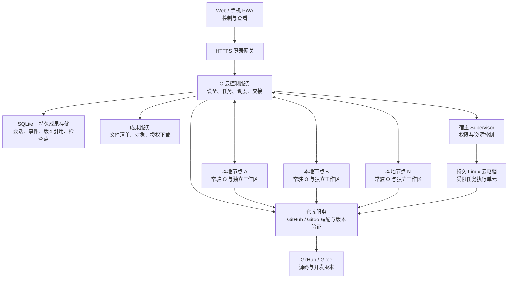

> 2026-10-08 更新：当前产品范围为个人服务器、一个主账户管理多台电脑，远程交互为发送消息、接收回复与选择目标电脑的模型／权限。登录与注册及后续范围以 [远程聊天与登录设计](remote-chat-and-auth.md) 为准。

# O 云端优先、多设备执行与仓库项目设计方案

日期：2026-10-03。版本：v2.13。状态：持续实施与验收基线。当前已接入云端 Agent 持久任务与 Web/PWA 控制入口、多台独立本地执行节点、任务与成果持久化、认证 WSS 节点唤醒（带 HTTPS 轮询回退）、Git/Git LFS、固定远端 commit 的经校验子模块 hydration 与有限层级的本地文件增量 sidecar、受控 Git 发布（含子仓库提交 ref 的持久计划、受限创建和远端读回）、Linux Bubblewrap/systemd/cgroup 沙箱及 ext4/XFS 配额、检查点续接、在线安全暂停请求及节点 outbox 恢复、加密备份原语、可撤销的限时成果下载链接和可配置的 S3 兼容成果对象存储后端。云端 S3 对象支持绑定活动任务租约的五分钟执行节点只读签名下载票据；浏览器登录态下载使用同源控制路由验证成果元数据后，重定向到仅含单对象、五分钟有效期及签名附件文件名的对象 URL，使成果字节不经过 Web/控制服务；对已通过 provider 联验并显式设置 `O_ARTIFACT_S3_DIRECT_UPLOAD=true` 的 S3 后端，执行节点和浏览器成果上传 API 对不超过 500,000,000 字节的单批成果支持带 SHA-256 请求校验的短期预签名 PUT，S3 端校验上传正文摘要后，控制服务再完整读回、核对 SHA-256/长度、条件提升到内容寻址键并读回确认后才持久化成果及任务关联。该开关默认关闭且只决定新上传；已持久化为直传模式的未完成上传在服务重启后关闭开关仍可续办。未验证 provider、新上传开关关闭、大于单批阈值或不支持直传的新上传仍走 8 MiB 可续传上传块。阈值仅限制单次直传批次，不限制本地任务、项目或成果总大小。浏览器上传现支持通用文件选择、图片粘贴与拖放、逐项进度/取消、断点续传，并将附件绑定到云端或本地隔离任务；执行节点按任务租约下载、校验并以只读方式暂存输入文件，任务收尾前清理，防止输入混入项目成果。安全续接到云端时会原样重新绑定输入附件并在云端任务 workspace 重新校验暂存。Linux Agent 现可在任务轮次内启动 Bubblewrap/cgroup 隔离的 Chromium 会话，浏览、DOM 摘要和截图可进入模型上下文；支持图像输入的 OpenAI Chat/Responses 模型接收截图，其余模型仍可使用页面文本。页面写操作走外部写权限策略；每台 O 主机同时只允许一个浏览器会话，资源不足时排队，1.5 GiB 浏览器预算会从同一进程的本地/云端任务调度余量扣除，启动前还要求至少有该沙箱预算与 512 MiB 控制面余量。浏览器页面、Cookie 和标签页仅在当前 Agent 轮次中存在，轮次结束清理；暂不支持跨任务持久页面恢复或用户配置文件同步。该能力需要 Linux 主机预装位于 `/usr` 的 Chrome/Chromium，并且尚待 Ubuntu VPS 实机联验。附件及网页内容均作为不可信输入，仍需由权限策略约束工具行为。本地对象存储继续走内容摘要校验后的应用服务代理，公开分享链接仍走独立的可撤销授权。尚需实机和外部服务验收：Ubuntu VPS 沙箱与 quota、真实 GitHub/Gitee 授权及远端 LFS 读回、S3 真实服务与生命周期策略验收、失联节点的外部状态核查与执行段转移真机验收、PWA 推送和异地备份恢复演练。

### v2.10：任务内 Linux 浏览器执行

Linux Bubblewrap 执行环境在预装支持版本 Chrome/Chromium 时，向 Agent 提供 `browser_session` 工具。浏览器作为单独的 O worker 进程运行在独立 Bubblewrap、systemd scope 与 cgroup 内；Chrome 的 CDP 仅绑定沙箱回环地址，profile 使用轮次临时目录。允许的目标必须是用户/Agent 明确列出的精确主机名，目标 DNS 在启动前解析并通过 cgroup IPAddress 白名单；导航不能扩展既有白名单。打开、导航、检查和截图走外部只读权限，点击、输入和按键走外部写权限，关闭始终允许作为清理。工具向模型返回最多 24 KiB 页面文本及最多 6 MiB JPEG 截图，Responses 适配器可将截图传入视觉模型。云端对单主机浏览器会话做排队串行化，只有 `MemAvailable` 达到一个 1.5 GiB 沙箱上限加 512 MiB 主机预留才会启动；会话最长 24 小时作为失联进程清理上限，正常任务沙箱仍保持原来的 180 秒上限。此轮内的标签页状态有效，任务结束/取消时会清理，不持久化登录 Cookie，也不承诺跨执行节点迁移浏览器内存状态。缺少 Bubblewrap、systemd-run/cgroup v2 或可见的 `/usr` 下 Chrome 时，工具不对 Agent 宣告可用。Windows 只可交叉编译，Ubuntu 的 Chrome 启动、网络过滤、截图与页面交互仍需真机验收。

### v2.10 验证记录补充（2026-10-03）

本轮 Web 验证通过：ESLint、9 项 Web/PWA 测试、TypeScript 类型检查、Web standalone 生产构建和桌面 UI 构建。Go 全仓 `go vet ./...`、Windows amd64 全仓构建及 Linux amd64 全仓交叉构建通过。Windows 主机选取的 33 个含测试包均成功编译并运行；除 `internal/coretools` 的 `TestCoreToolsExecution` 外，其他已运行测试通过。该集成用例已实际运行，但当前受控 Windows 主机返回 HRESULT `0x80070002`，无法创建 AppContainer；该项状态是环境阻塞而非通过。CoreTools 其余本轮定向用例通过。Pluginforge 与 Promotion 首轮测试因默认用户级 sumdb 缓存无访问权限失败；将 Go 临时目录/模块缓存限定在工作区并使用模块 `go.sum` 校验后，两个包全量测试通过。当前主机没有可用 Linux runtime，因而本记录不覆盖 Ubuntu VPS、Bubblewrap/cgroup、ext4/XFS 内核 quota、Chromium 网络过滤或截图交互实机结果。

### v2.13：子仓库提交引用采用永久保留策略

对子仓库 gitlink 对应的 `refs/heads/o-agent-objects/<sha>` 明确采用永久保留、禁止自动 prune 的策略。父仓库的 gitlink SHA 不在子仓库的常规 ref 可达图中，服务端仅查看某个已登记父项目，无法证明 SHA 不再被其他仓库、历史分支或 tag 使用。因此 O 不提供子仓库 ref 删除 API，也不在发布或清理任务中删除这些 refs；同一 commit 复用同一 ref，额外存储只有小型 ref 记录。若确需回收，只能由仓库所有者先在代码托管服务端完成全局父仓库/历史引用审计后手动执行。自动清理测试确认发布路径只读或 create-only，不执行 push --delete、fetch --prune 或 update-ref -d。真实 GitHub/Gitee 权限和服务端行为仍待验收。

### v2.12：持久化跨设备逻辑任务与执行段

本地执行和云端续接现在显式共享 `logicalTaskId`，每个可单独租约、报告和核查的执行段保留自己的 task ID；后续段通过 `parentTaskId` 和单调 `segmentIndex` 关联。旧任务迁移时以原 task ID 回填逻辑任务 ID。任务中心显示同一逻辑任务的段数和各段状态，避免把云端续接误认为覆盖了本地历史。创建云段时，任务记录、输入成果绑定和会话激活仍在同一事务内完成；幂等重试读回既有 lineage。Storage 回归覆盖重启与 lineage 持久化，HTTP 回归验证本地段到云端段的父子关联。

执行段保持独立的租约和审计记录；跨段续接要求源段先安全结束并逐项核查外部效果，不复用旧段 ID，也不自动重放未知副作用。设备失联期间的真实外部状态仍需人工确认/现场核查，不能仅靠服务器推断。

### v2.11：逐项核查跨节点外部效果

云端续接预览从已校验 transcript 的当前 Agent turn trace 生成外部效果清单。继续请求现在必须为清单内每个 `toolCallId` 提交唯一结果：`confirmed_applied`、`confirmed_not_applied` 或 `unknown`；缺项、重复项、伪造 ID、无效值，以及只提交旧版总确认布尔值，都会阻止创建云任务。用户选择“未知”仍可建立独立云端续接，但决策会与效果清单一起持久写入新任务 payload，且续接指令要求 Agent 先核对外部当前状态，禁止盲目重试。UI 显示每项工具和 trace 状态，要求逐项选择，未完成时不能提交。Storage/API 回归验证精确集合绑定、错误输入拒绝、旧式总确认不足、续接 payload 持久读回与相同决定的幂等重试。

### v2.9：Responses 工具结果支持视觉输入

OpenAI Responses 适配器现在识别内部 Markdown 图片约定，并把 user/tool 消息中的图片转换为 `input_image`；对工具结果使用 Responses 文档允许的 `function_call_output.output` 多模态数组。每张 base64 内嵌图片最多 6 MiB；格式损坏或超限会明确失败。回归验证工具截图路径、文字/图像顺序和拒绝边界。此改动只打通图片到模型的协议层，真实 Linux 浏览器运行时、持久会话、页面交互和截图仍待实现与验收。([Responses API reference](https://platform.openai.com/docs/api-reference/responses))

### v2.8：Linux 配额安装路径拒绝符号链接

Ubuntu 安装器会在创建系统账号或暂存版本前检查 `/etc/o-agent` 必须是真实目录，`cloud.env` 与 `quota-helper.env` 必须是普通文件；路径类型不符时在修改前失败关闭。检查逻辑拆为可复用脚本，Ubuntu CI 对普通路径、符号链接和 FIFO 执行回归，并校验该脚本进入发布包。ext4/XFS 内核配额拒写集成用例改用 O 的高位 project ID 范围，实际 Ubuntu CI 运行结果仍待观察；Windows 开发机只能交叉编译 Linux 测试，不能替代内核执行。

### v2.7：Linux 任务配额 ID 保留命名空间

新的 Linux task workspace 配额分配使用 `0x80000000–0xffffffff` 高位 ID 段，降低与发行版或运维常用低位 project ID 冲突的风险；管理员需要将该段保留给 O。既有任务的 ID 在重试和重启后保持不变，不自动重分配。Storage 回归验证高位范围、任务间唯一性、幂等重试和数据库重启读回。该命名空间不能替代 Ubuntu/VPS 上对实际内核配额和管理员 ID 使用范围的验收。

### v2.6：持久化执行阶段与任务中心进度

执行节点将阶段状态与活动租约续期放在同一事务中提交，并从任务事件读回核验；阶段按 attempt 隔离且只允许前进，事件写入失败会回滚租约续期。节点上报准备、Agent 执行/快照、安全边界、outbox 本地持久化、成果上传和成果校验阶段。任务中心从服务端持久化记录显示最新阶段和更新时间。Storage 回归覆盖单调性、事务回滚及数据库重启读回；HTTP API 与执行节点包全量回归通过。阶段展示不代表同一 task 已原子迁移到另一执行器，也不替代真实云端环境验收。

### v2.5：浏览器输入附件与云端续接

任务 composer 已支持文件选择、图片粘贴及文件拖放；文件逐项使用可取消的 8 MiB 分块上传并显示进度。附件与提示一起提交时，会先核对成果清单，再在同一持久化事务中绑定为 `user_input`，云端任务与本地节点任务均在响应后读回 payload 和附件关系。仅当执行目标支持隔离任务且 artifact 存储可用时显示附件入口；附件上传完成但任务提交失败时保留本地选中态并可幂等重试，不把上传成功误报成任务已提交。

云端 Worker 校验 payload manifest 与任务附件角色/摘要/长度；云端 Agent workspace 和本地节点 workspace 通过绑定任务的下载路径重新核对对象字节、大小及 SHA-256 后，将文件以只读属性放入任务专属输入目录，并把明确标注为不可信的文件路径交给 Agent。任务结束前清理暂存输入；清理失败会使任务走错误/核查状态，不生成看似成功的项目成果。云端续接会将原 `user_input` artifact 原子关联到新云任务，并将附件 manifest 放入续接 payload，确保跨执行位置时输入仍可恢复。回归覆盖本地/云端的附件 manifest 与 durable link、续接保留附件、任务工作区内容校验、重试幂等、篡改拒绝及清理边界。登录 Cookie 设置 HttpOnly/Secure、30 天有效期及持久数据库 session；新增服务重启后复用原登录 Cookie 访问受保护 session API 的回归。浏览器类型检查、lint、9 项 Web 测试与 production build 已通过；Go vet、Agent/Execution/HTTP API 三个相关包的全量测试均通过；Agent 测试包含 Windows 开发环境下的完整云端续接与 task workspace 回归。Windows 全仓 `go test ./...` 已尝试：直接启动 Go 临时目录中的测试子进程被受控主机拒绝，故关键修改包改为编译到工作区后直接运行；CoreTools 的 AppContainer 集成测试因 HRESULT `0x80070002` 失败，Pluginforge/Promotion 的嵌套插件参考构建还缺少 goja 的部分传递模块缓存，访问用户级 sumdb 目录也被拒绝。这些平台/依赖边界不影响已通过包的结果，但全仓测试仍需在具备 AppContainer 和完整模块缓存的 CI/Windows 主机复核。本轮 `GOOS=linux GOARCH=amd64 CGO_ENABLED=0 go build ./...` 通过，并交叉编译了 projectquota、sandbox、Agent 和 HTTP API 测试二进制；当前开发机未安装 WSL Linux 发行版，不能据此宣称 Bubblewrap、cgroup 或 ext4/XFS 内核配额已实机验证。

仍未完成或需真实环境验收：Ubuntu VPS 上的 Bubblewrap/systemd/cgroup 与硬配额实机验收、真实 GitHub/Gitee 与 Git LFS、真实 S3 provider、失联节点的外部状态核查与执行段转移真机验收、跨任务持久浏览器会话与页面接管升级、PWA 推送及异地备份恢复演练。

### v2.4：分块上传客户端核心（历史阶段）

Web API 客户端新增 `uploadArtifactFile`：用幂等键创建持久上传，按服务端 8 MiB 块大小对 `Blob.slice()` 单块计算 SHA-256，不把完整文件载入内存；先分页读回服务端块清单，只跳过摘要和字节数均匹配的已存分块，瞬时网络/408/425/429/5xx 错误以相同分块摘要重试，确定性错误立即返回。最后调用幂等 finalize，并核对 artifact ID、文件名、大小和 SHA-256。在 v2.4 阶段仅完成可复用客户端传输层与回归测试；浏览器输入附件 UI 与 Agent 暂存随后在 v2.5 接入。

### v2.3：浏览器成果上传 API 支持 S3 直传

已登录 Web 客户端调用 `POST /api/v1/artifacts/uploads` 时，后端根据当前持久 S3 配置、显式直传开关、上传大小和声明 SHA-256 选择模式。符合条件的上传会先持久化 `direct_upload` 状态，再返回仅对应 staging object、五分钟有效、绑定 `x-amz-checksum-sha256` 的 PUT URL；客户端以相同幂等键再次 begin 可拿到同一上传的短期新 URL。调用方必须禁止跟随跨域重定向，provider 需要允许 Web origin 对 PUT 和 checksum header 执行 CORS。完成上传后复用既有 finalize：服务器校验并读回 staging object、条件复制至内容寻址 key、完整读回核对哈希/长度，之后才持久保存 artifact。阈值以上、没有摘要、没有启用开关或本地存储时继续返回原 8 MiB 可续传代理模式；不拒绝大文件。

HTTP API 回归确认无登录态请求既拿不到 URL 也不会创建上传记录；带 Cookie 的用户会话可完成 fake S3 PUT 与 finalize，begin 重试返回同一持久 upload 和新 capability，且签名 URL 响应设置 `private, no-store` 与 `no-referrer`。大于 500,000,000 字节的声明仍创建分块上传而不发放单批直传 URL。前端文件选择、增量 SHA-256 计算、上传进度与断点续传组件尚未接入；真实 provider CORS、PUT checksum 和条件复制仍需联验。

### v2.1：执行节点成果经校验预签名直传

使用 S3 兼容远端且运维在真实验证 PUT checksum 与条件 CopyObject 后显式启用 `O_ARTIFACT_S3_DIRECT_UPLOAD=true`、单件成果不超过 500,000,000 字节时，节点完成同一任务租约下的 artifact begin 后获得仅针对 staging key 的五分钟 PUT capability，签名绑定 SHA-256 checksum header。默认关闭此开关，避免把不完整实现这些 S3 能力的 provider 自动切入新上传直传。`direct_upload` 模式在 SQLite 中持久化并读回；该模式不接受混入代理分块，代理模式也不能切换到直传。节点只向签名 URL 发送指定长度的文件流，禁止跨主机重定向以免泄露签名 header；provider 接受后，控制服务 HEAD 核对大小/ETag、完整 GET 计算 SHA-256 和长度、使用源 ETag 条件复制到内容寻址 key，再完整读回 canonical object，之后才完成 artifact 与 task 关联并读回确认。失败或校验不符不会报告成功；重试从 durable upload state 重新取得 capability 或执行 finalize reconciliation。关闭开关只影响新上传，已持久化的直传任务仍可更新短期 capability 并完成。未启用、没有 S3 capability 的部署和超过单批阈值的新成果继续使用已有 8 MiB 持久分块续传路径，500MB 不成为任务/文件拒绝条件。

Storage、artifactstore、执行节点与 HTTP API 回归覆盖数据库重启、schema 迁移、直传/分块模式冲突失败关闭、未持有活动任务租约时不创建上传记录或发放 capability、无效 checksum、签名重算、禁止重定向、上传与下载失败文本不泄漏预签名 URL、对象完整读回、条件提升、任务成果关联读回和幂等 finalize；边界回归确认恰好 500,000,000 字节可走单批直传，超过后只切换为可续传分块而不拒绝成果。当前验证基于独立实现 SigV4 与 checksum 的 fake S3 provider；尚未在真实 AWS/S3 兼容服务验证 PUT checksum、CopyObject 条件、签名 TTL、请求费用或 lifecycle 行为。部署 bucket 应配置私有访问和暂存对象过期清理，并为未完成/失联任务保留足够恢复窗口。Web 文件上传组件尚待实现与实机验收。

### v2.0：浏览器成果通过对象存储直读

登录用户从任务中心下载成果时，控制路由会先从 SQLite 读取所属成果元数据，再由 S3 后端核验对象 HEAD 和大小并创建最长五分钟、单对象范围的 SigV4 GET URL；URL 签名覆盖 attachment 文件名、`private, no-store` 缓存头和 `application/octet-stream` 响应类型。控制服务返回 `307 Temporary Redirect`，设置 `private, no-store` 与 `no-referrer`，浏览器随后从 S3 读取字节，不消耗 VPS 应用服务的成果下载带宽。若使用本地对象存储，则仍走原来的完整 SHA-256/字节数校验代理。公开分享下载仍受持久化分享 token、过期和撤销校验保护，不改成无会话直链。测试验证 provider URL 的响应头覆盖参数在签名内、浏览器响应体不包含成果字节、直链下载文件名正确，以及本地存储代理行为未变。此流程依赖真实 S3 兼容 provider 正确执行 SigV4 和响应覆盖参数；生产 bucket 生命周期、真实下载计费与 provider 联合验收仍待完成。

### v1.99：持久化子仓库 Git ref 发布计划

受控发布会从待发布父提交中的 `.gitmodules` 与固定 gitlink 递归生成有深度/数量上限的子仓库发布计划，核对每个子仓库 HTTPS origin、已检出的固定提交和安全路径，并在第一次远端写入前将不可变计划持久化。发布预览与确认框会显示子仓库路径、仓库 URL、目标 SHA/ref；此流程只发布用户已创建的子仓库 commit，不替用户生成子仓库 commit。云端按子仓库提交 SHA 创建 `refs/heads/o-agent-objects/<sha>`，仅在该 ref 不存在时使用空值 lease 创建，发现同名 ref 已指向其他提交时拒绝覆盖。每个子仓库在本地沙箱内使用该 URL 专属 Git 凭据；远端 ref 精确读回后才记录为 `published`，所有子仓库读回确认后才允许推进父分支。每个 child ref 的 pending/publishing/published/failed/needs_reconciliation 状态均在 SQLite 中读回；服务重启或网络结果不确定时只核查远端，不盲目重放发布。子仓库 commit-addressed refs 采用永久保留策略，O 不提供自动删除或 prune：Git 的父仓库 gitlink 不参与子仓库 ref 可达性，不能据单个项目分支证明 SHA 未被其他父仓库历史引用。远端 ref 很小且按 commit SHA 去重；若管理员必须回收，应先在仓库服务端核对所有父仓库、分支和历史 tag，再由仓库所有者手动删除。这样不会因 O 的局部视图误删仍被使用的对象。Agent 测试包在将临时目录设到工作区后全量通过；Storage 与 HTTP API 完整测试包、Go vet 和 Linux amd64 交叉编译也通过。新增测试覆盖递归 gitlink 计划、使用本地 bare Git 远端创建并读回 ref、拒绝同名错误 ref、旧 SQLite schema 迁移、数据库重启状态读回及子仓库未确认时禁止完成父发布。Ubuntu VPS 与真实 GitHub/Gitee 子仓库 push 仍待目标环境验收。

### v1.98：过期执行 attempt 跨节点重启隔离验证

新增 SQLite 重启回归：节点 A 的任务租约过期并转入 `needs_reconciliation` 后，在线节点 B 不能领取该任务，旧节点 A 也不能迟到写入成功结果；拒绝后数据库状态、attempt/sequence 和核查审计事件均保持可读回。恢复租约仍只用于恢复证据，不会恢复执行权。该机制以隔离未知副作用为先，**不把租约过期称作任务迁移**；只有原 attempt 已安全结束并完成成果核验后，才可创建具有新 task ID 的续接任务。

### v1.97：执行节点成果下载清理错误纳入状态

执行节点从 S3 或应用代理下载任务成果时，现在显式检查响应体关闭、失败临时文件移除及本地文件关闭错误；其中任何清理/持久化错误都会让下载返回失败，不留下可被调用方当作已验证成果的成功路径。回归额外覆盖了字节数正确但 SHA-256 不匹配的直接下载，确认节点拒绝并删除不完整的本地成果。该改动不改变本地存储或 S3 下载协议。

### v1.96：执行节点直读 S3 成果

节点通过 `GET /api/v1/nodes/tasks/{taskId}/artifact-downloads/{artifactId}/ticket` 获取此票据；该路径避开任务成果上传与上传状态路由，避免 HTTP 路由冲突。

执行节点先通过带节点凭据和当前任务租约的控制 API 获取任务范围内成果的下载票据。S3 后端先核验对象存在和声明字节数，再签发最长五分钟、只允许 GET、且仅包含单个对象的 SigV4 URL；对象 URL 不包含云端节点凭据或任务租约，服务端与节点均禁止跨主机明文 HTTP 和重定向泄漏凭据。节点下载后用票据中的 SHA-256 和字节数核验完整响应，再落盘为权限受限的临时成果文件。S3 暂不可用或成果由本地存储提供时，控制服务返回不含 URL 的代理票据，并沿用原有任务租约下载路径。控制票据绑定 task ID、artifact ID、内容摘要及长度，非当前任务关联成果和过期租约不能签发票据。

回归覆盖 SigV4 查询签名重建、会话令牌、过期拒绝、节点直读时不转发控制凭据、落盘后的完整内容校验、本地存储代理票据以及跨任务成果拒绝。该路径已从结构上移除 S3 成果下载的数据流经应用服务器；尚未在真实 S3 provider 上核验兼容性、生命周期、访问日志和流量账单，生产结论需等待真实 bucket 与 Ubuntu VPS 联合验收。

### v1.95：交接和项目导入显式核验成果清理

远端 artifact 下载使用本机临时文件。现在项目增量导入会在所有 Git/LFS/子模块成果消费后显式关闭读取器；若导入成功但清理失败，先读回项目绑定的最终 commit，再返回可幂等重试的错误，不把状态不明的操作报告为成功。云端续接读取 transcript 时在解析后立即关闭成果文件，并把读错误、清理错误和内容身份核验统一处理。加密 checkpoint 分块流式读取也将文件关闭错误纳入返回状态；纯下载响应无法在流已发送后更改 HTTP 状态，因此会记录临时文件清理错误供运维排查。HTTP API 和 Agent 全包测试二进制在本机直接运行通过；目标 VPS 的远端临时盘回收与服务重启仍需验收。

### v1.94：成果对象存储接入 S3 兼容后端

新增可选 S3 兼容内容寻址对象存储。运维通过 `O_ARTIFACT_STORE_BACKEND=s3` 和 `O_ARTIFACT_S3_*` 配置端点、区域、bucket、凭据、对象前缀及寻址方式；默认继续使用本地存储。公网端点必须 HTTPS，HTTP 仅允许 loopback 测试。上传沿用既有分块续传入口，服务端先在本机组装并计算内容摘要，再用 SigV4 写入远端；大对象采用 multipart，遇到失败会尝试中止未完成上传。**只有远端完整读回且 SHA-256 和字节数与上传声明一致后，数据库才会持久记录成果可用。**打开远端成果时也完整读回并重新校验，提供 seekable 临时文件，调用方关闭后删除该临时文件。重启后从数据库元数据和远端对象恢复，不要求对象内容常驻 VPS 磁盘。旧版本本地对象不会在切换时批量搬迁：读取到某个旧成果且远端明确报告对象不存在时，服务会先核验本地旧对象，再复制到远端并读回校验；本地旧副本保留为恢复证据。容量接口区分远端成果、本机旧对象与暂存空间。

S3 集成回归由 fake provider 独立重算 SigV4 签名并核验请求正文摘要，覆盖未归一化的对象路径、会话令牌、上传/下载/HEAD、带命名空间的 multipart、完整读回后提交、远端损坏失败关闭、重试、本地旧成果按需迁移、SQLite 重启读取和远端临时文件关闭清理。v1.96 起，执行节点的 S3 成果下载会使用任务租约授权的五分钟只读签名 URL，避免成果响应体通过应用服务器中转；本机成果暂存及上传组装仍需要 VPS 临时磁盘空间。尚未配置真实 provider 凭据、远端版本保护、生命周期策略、访问日志和 VPS 故障恢复演练，不能据此声称真实 provider 已验收。生产启用前必须配置专用私有 bucket、最小权限凭据、对象版本/删除保护和生命周期规则，并完成真实上传读回及恢复验收。

v1.93 将子模块文件级增量 sidecar 从直接子模块扩展到已初始化的嵌套层级，沿用 hydration 的最大深度和仓库数量边界，按每个子模块固定 gitlink 基线记录 tracked/untracked 文件变化，并在接收端递归核验仓库 URL、基线与文件摘要后应用。持久任务项目的幂等重试会复用已核验的 hydration 结果，避免对 sidecar 合法修改后的 `.gitmodules` 再次执行初始 hydration；新增任务项目重复导入会读回同一工作区和嵌套文件。删除嵌套 gitlink 作为显式动作同步；接收端检查基线、远端身份、tracked 改动以及包括 ignored 文件在内的未跟踪内容后才移除子模块工作目录，重复导入验证删除状态。两层子模块的增量、删除、任务导入和幂等重试集成测试通过；v1.99 补入受控的子仓库 Git ref 发布。

v1.91 增加 direct submodule 文件级增量快照：相对固定 gitlink 基线收集已跟踪修改、删除、未跟踪文件和符号链接，写入含版本、仓库身份、基线、路径清单与 SHA-256 的 tar sidecar；父仓库 delta 暂时固定 gitlink 基线，避免依赖未发布的子仓库 commit。sidecar 经节点 outbox、分块续传、云端 task artifact、云到本地派发和项目导入路径；接收端要求目标子模块仍在基线，拒绝覆盖快照后发生的不同修改，逐项应用后校验读回。集成回归覆盖跨仓库导入、归档篡改导致的工作区回滚、重复快照和节点重启 outbox 续传。此版本尚不把子模块本地修改发布成子仓库 Git commit/ref，且直接子模块内部再嵌套的本地修改仍未打包；二者不能被表述为已完成的 Git 发布或无限层级同步。

v1.90 为 GitHub/Gitee 主仓库 clone、固定版本项目导入、本地项目准备、云端任务 worktree 和本地成果 delta 导入增加逐层子模块 hydration。固定版本导入先 checkout 指定 commit，再读取该 commit 的 `.gitmodules`；常规仓库 clone 则按所选分支头准备子模块。系统要求每个路径对应真实 gitlink、目标路径不穿越符号链接；仅接受 GitHub/Gitee HTTPS 仓库或解析后仍属于同一 owner 的相对 URL。每个子模块先执行无网络初始化，再从本机 Git 配置读回对应名称的 URL 并与白名单比对，之后才在限制为 HTTPS、关闭重定向、精确凭据 URL 范围和域名 egress 的沙箱中逐个 fetch；嵌套层级与总数均有上限。已初始化子模块若 URL 或 commit 与固定 gitlink 不同，系统会拒绝重写并保留现有目录；失败不会将临时导入登记成可用项目，也不会覆盖已有工作区。既有任务 workspace 子模块不可用时会持久降级其 workspace 状态，阻止 Agent 在缺少项目内容时启动。v1.90 当时只获取远端已存在的固定子模块 commit，子模块内部本地改动的独立 delta 打包尚未实现；该缺口由 v1.91 的 direct submodule 文件级 sidecar 补齐，嵌套子模块本地改动和子仓库 ref 发布仍未实现。新增 Git 原始配置输出解析、固定 commit blob 读取、未授权 file transport 在网络调用前拒绝以及 workspace 降级重启读回测试；真实私有 GitHub/Gitee 子模块授权与 Ubuntu egress 仍需目标环境验收。

v1.88 本次新增带节点凭据的 WebSocket 唤醒通道：在线节点建立连接后立即收到重连唤醒；新任务落库并核验后向对应节点发送合并唤醒。节点收到通知后仍从 SQLite 任务队列领取并核验租约；断线自动重连，连接不可用时保留 HTTPS 轮询，因此通知丢失不会丢任务。

v1.89 补齐节点唤醒与撤销边界：资源心跳确认可用槽位增加时会唤醒等待中的 poller；持久化撤销节点后，云端立即关闭其活动 socket，本地收到明确认证拒绝后停止 worker，而普通 WSS 故障仍降级到轮询。集成测试覆盖控制服务和 SQLite 重启后领取离线期间入队的任务、撤销后关闭在线 socket，以及 WSS 返回 503 时仍通过 HTTPS 完成任务。

v1.30 本次新增节点端持久结果 outbox：成果上传前原子保存任务结果、需上传的 Git bundle 和租约，节点重启后先核验自己的云端任务状态与活动租约，再幂等续传或对已成功结果做比对后清理；遇到过期租约或结果不匹配时保留本地现场并要求核查。

本文整合并替代此前方案中的双电脑模型，采用一台云端电脑、N 台独立本地电脑、统一 Web/PWA 入口、云端记录、GitHub/Gitee 优先的项目承载方式。实施按本方案分阶段推进；任何线上 VPS 部署、远端仓库创建或当前工作区推送都需要单独完成运行环境与授权准备。

## 1. 已确定的产品原则

1. Web/PWA 只提供登录、控制、选择电脑、查看记录与成果等交互；Agent 推理流程、浏览器、命令和工具在执行节点运行。
2. 一台云端电脑既是可执行节点，也是控制和记录中心；两种角色必须隔离。
3. N 台本地电脑独立执行，任务、项目、凭据和工作目录默认不向其他本地电脑下发。
4. 云端统一保存获准上传的会话、任务事件、版本引用、检查点和成果；本地离线新增记录先进入持久 outbox，联网后补交。
5. 开发项目默认使用 GitHub/Gitee 仓库作为代码版本的权威来源；目录路径只是某执行节点的工作副本位置。
6. 500MB 是单批直接传输的分流阈值，不是本地项目、执行或总同步量上限。超过阈值使用增量同步、分块断点续传或经授权的成果链接，不能因此拒绝普通任务。
7. 每次形成一个开发交付版本，都应提交到已授权的远端任务分支，并经过远端版本回读确认。
8. 任务可在满足条件时交给云端继续；迁移的是已确认的执行检查点、代码版本和必要文件，不承诺任意进程或浏览器登录状态的透明迁移。
9. 任务执行结束、代码归档、成果可用、项目合并和部署上线是不同状态，不能相互替代。

用户现有 VPS：4 核、4GB 内存、40GB 系统盘、Ubuntu 26、峰值带宽 1000M、350GB 月流量。具体系统小版本、实际资源与服务商流量口径待预检。默认面向一个用户及其多台设备，暂不引入多用户集群。

## 2. “把项目变成链接”的准确含义

O 不再把某台电脑的绝对目录作为项目身份，而保存一个可解析、可校验、有权限的项目引用。

| 字段 | 含义 |
| --- | --- |
| projectId | O 内部稳定项目 ID，不随目录搬迁或仓库更名变化 |
| provider / repositoryId | GitHub/Gitee 平台及可获得的稳定仓库标识 |
| repositoryUrl | 规范化仓库地址，不内嵌密码或 token |
| defaultRef | 用户选择的基线分支，不猜测仓库使用 main 或 master |
| resolvedCommit | 当前任务实际使用的完整 commit SHA |
| taskRef | 本次任务的独立远端分支 |
| artifactManifestId | 关联的非代码成果清单 |
| environmentSpecId | 工具版本、锁文件、系统与环境要求 |
| credentialBindingId | 受控凭据绑定，只存引用，不存明文密钥 |

仓库 URL 和分支名只能说明“去哪里找”；分支会变化。真正用于恢复、交接和验收的是仓库身份、不可变 commit、必要成果清单与环境要求的组合。

链接不是让数据消失：源码仍保存在代码托管平台，运行成果保存在成果存储，任务记录保存在控制数据库。执行时仍需要下载或挂载必要文件。本地副本可以按规则回收，但不能在尚未远端确认时删除。

## 3. 整体架构

图中的节点到仓库服务表示受控发布/读取请求，不代表为 Agent 开放任意仓库管理权限。读取获准源码可使用限定凭据；写入由仓库服务校验目标、任务版本和授权后执行。

首版所有云端组件可以在同一台 VPS 上分进程、系统账号和隔离边界运行。Web 的页面服务不承担任务计算。数据库、凭据服务和成果档案位于 Agent 运行区之外。

## 4. 存储分工与权威来源

| 数据 | 权威来源 | 本地角色 |
| --- | --- | --- |
| 已归档源码与设计文档 | 已授权 GitHub/Gitee 仓库的确切 commit | checkout / worktree 与未提交修改 |
| 项目默认分支、绑定与策略 | 云控制数据库 | 有版本的缓存 |
| 会话、任务、审批、执行归属 | 云控制数据库 | 执行缓存和待同步日志 |
| 报告、图片、视频、数据集、构建包 | 成果服务；适用时使用平台 Release 或经核验的 LFS | 工作文件与按需缓存 |
| checkpoint | 云数据库中的已提交检查点，绑定代码和成果版本 | 本地候选检查点与 outbox |
| 密钥、token、登录态 | 独立凭据保管服务或本机安全存储 | 仅接触获准能力，不进入 Git |
| 依赖与编译缓存 | 可重建缓存，无业务权威性 | 独立缓存配额，不当作项目备份 |

GitHub 普通 Git 文件大于 100MiB 会被阻止，Git 也不适合保存大数据库与依赖目录。项目代码进入 Git；大型文件进入成果服务或适用的 LFS/Release。GitHub LFS 使用指针关联实际对象，指针存在不等于对象已可下载。[GitHub 大文件规则](https://docs.github.com/en/repositories/working-with-files/managing-large-files/about-large-files-on-github)、[Git LFS](https://docs.github.com/en/repositories/working-with-files/managing-large-files/about-git-large-file-storage)。

本地 A/B 默认只获取自己的任务范围；Web 经用户认证可以查看全局记录。云端任务同样只获取当前项目获准的数据，统一档案不会自动全部注入每个任务上下文。

## 5. 500MB 传输批次与大项目处理

### 5.1 统一口径

本文将用户的“500m”定义为十进制 500MB，即 **500,000,000 字节**，作为一次直接传输批次的分流阈值。它不限制项目大小、本地电脑可运行的项目、总上传量或用户发起任务的权限。多 worktree 与并行任务按各自文件清单增量同步，不因累计超过阈值而被拒绝。

需要估算一次同步工作量时，计量项目文件清单中的逻辑字节，包含源码、`.git`、已下载 LFS 对象、未跟踪/被忽略文件、项目内依赖、临时输出与构建成果。估算用于选择传输方式、显示进度与预估流量，不是本地资源配额或拒绝条件。

硬链接和重复副本可保守计量；符号链接只按目标路径文本的字节计量，不跟随或读取链接目标；特殊文件等无法准确测量时记录估算未知，按大数据路径处理并继续任务。整机磁盘不足属于具体执行节点的资源错误，应保留本地工作并明确提示，不能把 500MB 阈值当作替代磁盘管理的规则。

依赖缓存、数据集、项目文件和成果按来源、可重建性及授权分别管理，不为满足 500MB 而移动或删除用户文件。项目内 `node_modules`、`.git` 和输出仍参与变更清单与同步判断；公共缓存可按独立策略避免重复传输。

### 5.2 行为规则

| 情形 | 行为 |
| --- | --- |
| 单个直接同步批次小于或等于 500MB | 可直接传输，并验证内容哈希 |
| 单个直接同步批次大于 500MB | 自动按 Git 增量、分块续传或多个可恢复批次传输；任务与本地执行继续可用 |
| 项目含大型模型、数据集或生成成果 | 用户可选择上传到已授权的成果存储并附加受控链接；普通云端记录保存清单、哈希、权限和链接状态 |
| 本地离线或同步服务暂不可用 | 本地任务继续；变更进入持久 outbox，云端接续状态显示哪些项目/成果仍待同步 |
| 某个云端目标自身空间或平台配额不足 | 不伪报该目标已同步；提示改用分块/链接/其他授权目标，同时保留本地任务和唯一副本 |

同步必须记录对象清单、字节数、哈希、已确认偏移和重试状态。相同 Git 对象/文件块增量复用；大文件分块可断点续传。上传成果链接前校验用户授权、可见范围与有效期，云端保存稳定对象引用和校验信息，不把临时签名 URL 当作永久地址。

同步中断时，本地文件和任务保持原状；只有目标端完整读回并验证哈希后，才把对应对象标记为已同步。部分上传保留为可续传状态，不把不完整对象登记为完整成果。

### 5.3 “强制上云”的含义

超过阈值后，传输层切换到增量/分块/链接路径；不拒绝本地任务，不要求为继续使用本地功能先把全部数据搬上云。

自动同步仍受用户的仓库和成果授权范围约束，不把秘密或任意私人目录公开上传。尚未授权的内容留在本地并明确显示“未同步”；需要云端接续时，只要求补齐该次接续实际依赖的文件和成果，不以此阻止用户继续本地工作。

仓库项目本身没有 500MB 上限。浅克隆、稀疏检出和按需 LFS 可减少传输量；需要的历史、文件或成果仍可增量取得，不能只凭链接或 LFS 指针宣称内容已在接续节点可用。[Git clone 选项](https://git-scm.com/docs/git-clone)。

## 6. 仓库优先的项目导入

Web 的默认入口为“导入 GitHub/Gitee 仓库”，本地目录作为次要入口。

1. 用户选择仓库、基线分支及权限范围；私有仓库完成限定授权。
2. 云端规范化 URL，记录仓库身份和选定 ref，拒绝 URL 内嵌凭据。
3. 解析并验证实际 commit；记录它作为本次任务基线。执行过程中远端分支变动不会偷偷改变基线。
4. 校验所需 LFS 对象、子模块、锁文件及环境要求。子模块固定版本，独立验证域名和权限，不因主仓库获准就允许任意关联仓库。
5. 预估输入体积，并在实际准备过程中实施配额。
6. 用户选择云端或合格本地节点，执行节点准备该 commit 的独立工作副本。
7. 节点读回 Git HEAD 和文件清单；满足条件后才标记“项目已准备，可执行”。

仓库可读不等于可写，clone 成功不等于环境可运行，URL 有效不等于版本和依赖可恢复。

新项目默认先建立已授权的私有仓库再开始长期开发；公开可见性须单独选择。仅小型临时项目允许暂不仓库化，但 UI 明示其接续与归档限制。

导入任意 URL 必须阻止 SSRF、内网地址、云 metadata、危险 Git transport、路径逃逸和不受控重定向。准备源码不执行仓库脚本或安装依赖；相关执行需进入沙箱并按任务权限处理。

## 7. 开发版本的提交、推送与确认

### 7.1 默认发布策略

用户的“每次最终版本 push”定义为：每次开发任务形成可交付版本，都进入远端归档流程。它不意味着每次敲键盘都推送，也不意味着自动覆盖主分支。

每个开发任务基于确定的 commit 使用独立任务分支，示例命名 `codex/<task-id>`，服从项目自身分支规则。多个设备不共享一个可写任务分支。同一任务更换执行电脑时延续受控任务分支和归属版本。

工作分支已授权时，可按用户设定自动归档。合并基线、发布 Release、修改可见性、部署和运行平台 CI 分别受项目策略控制，不由“push 已授权”自动推导。特别是 push 可能触发既有 CI，绑定仓库时应显示相关自动化；首版不额外创建自动部署工作流。

### 7.2 版本闭环

1. 固定候选工作版本，区分本次任务修改与用户已有修改；不把不属于任务的文件自动纳入。
2. 运行该项目要求的检查，保存结果；失败版本可保存为检查点，但不能称为可交付最终版本。
3. 检查文件分类、意外大文件、凭据和产物规则。密钥及运行数据库不进入源码 commit。
4. 形成 commit 并持久化待发布意图，包含目标仓库、ref、期望基线与目标 SHA。
5. 仓库服务确认权限和执行归属，推送确切 commit 到任务 ref，禁止默认 force push。
6. 从远端回读 ref/commit；验证目标 commit 存在，任务 ref 对应正确版本。不能只信命令退出码、HTTP 2xx 或平台 webhook。
7. 如使用 LFS，确认必要对象可被有权限的接续节点实际取得；只回读指针不足以确认可恢复。
8. 提交与这个代码版本绑定的非代码成果和检查点。
9. 云端接续/准备任务实际读取该版本并确认；之后才标记“可在云端继续”。

Git 的 push 有明确的 ref 更新和拒绝规则；并发变化应进入冲突处理，不能强制覆盖来制造成功。[Git push 文档](https://git-scm.com/docs/git-push)。

#### 当前已接入的受控发布 API

项目发布记录由云端 SQLite 持久化。项目弹窗提供“检查当前提交”与用户确认推送；`GET /api/v1/projects/{id}/publication-preview` 回读目标分支的本地 HEAD、远端 SHA、工作区状态和本次将发布的完整子仓库 SHA/ref 清单，避免用户确认前隐藏对其他仓库的写入；`POST /api/v1/projects/{id}/publications` 接收 `targetBranch`、`expectedRemoteSha` 和 `commitSha`，并要求 `Idempotency-Key`。当前实现限定已导入的本地 Git 工作树、GitHub/Gitee HTTPS origin、干净工作树和当前 HEAD；发布前确认远端 ref 仍等于调用方给出的预期 SHA，并确认提交包含该基线。推送只更新已存在的父仓库目标 ref，禁止 force push；只有远端 `ls-remote` 精确读回目标 SHA 后，发布才进入 `published`，并在同一事务中推进项目基线。UI 不会自动创建 commit，也不创建远端父分支。

发布意图在网络 push 之前先写入数据库。同一幂等键只能重放相同请求；同一项目分支不允许并行活动发布。重复的创建请求只读回当前记录，不会并发触发远端核查；发布与明确核查在同一进程内按 publication ID 串行，避免把正在执行的 push 误读成“远端仍为基线”。推送客户端超时或服务器读回失败时进入 `needs_reconciliation`，`POST /api/v1/projects/{id}/publications/{publicationId}/reconcile` 和 `GET /api/v1/projects/{id}/publications` 用于检查持久状态。系统不会自动重放不确定 push：若远端是目标 commit 则核实完成，若仍为原基线则标记该次尝试失败，其它状态保留核查原因。发布会先将提交中新增/修改且已下载的 Git LFS OID 上传到对应远端，再发布并读回所有固定子仓库 ref，最后推进父 Git ref 并读回 commit；任一步失败都不会把整体发布标记成功。当前发布 API 仍不包含 GitHub App 安装授权、跨节点仓库服务代理、自动建分支、远端 LFS 对象读取校验或 PR 创建；任务节点间新增/修改的 Git LFS 内容由任务 artifact 同步，不代表已发布到 GitHub/Gitee。仓库 clone 的子模块验证与执行节点的凭据授权不等同于发布授权。真实 GitHub/Gitee 账号 push/LFS read-back 与 Ubuntu 沙箱尚待目标环境验收。

UI 分别显示“执行结束”“待归档”“归档失败”“远端已确认”“待合并”“基线已合并”“可接续”“已部署”。远端分支保存成功不等于主线已更新，更不等于线上产品已更新。

### 7.3 失败与恢复

| 故障 | 处理 |
| --- | --- |
| 网络超时，结果未知 | 查询确切远端 ref 和 commit，再决定是否重试 |
| 远端拒绝或权限撤销 | 保留本地候选 commit、日志和待提交状态 |
| 非快进或 ref 被他人修改 | 标记冲突，准备合并/新分支，不默认 force push |
| 仓库容量/LFS 额度不足 | 改正文件承载或增加可用存储；不宣称归档完成 |
| 推送成功，云数据库写入失败 | 根据持久发布意图回读远端并修复记录，不撤销远端历史假装原子失败 |
| worker 在提交或上传中重启 | 从持久阶段记录核查实际结果，不重新执行开发任务 |
| 仓库已确认，其他成果未齐 | 保留“源码已归档、成果未齐”，禁止完整接续标记 |

源码仓库、成果存储和控制数据库无法用一个本地事务原子提交。采用持久多步协议、幂等标识和补偿/对账；不为了回滚清除他人提交或已确认成果。

未推送修改必须先有本地持久日志；可按策略保存到云端私有恢复快照。快照只是故障恢复材料，不替代用户要求的最终远端 commit。断网期间无法保证云端已经包含尚未上传的最新修改。

## 8. GitHub / Gitee 平台接入边界

采用平台适配器，不把全局数据模型绑定到某个平台的 PR 编号或 URL 形式。统一能力包括仓库读取、ref 解析、commit 验证、受控 Git 写入；PR、保护分支、LFS、Release 和配额各自暴露实际能力。

GitHub 推荐指定仓库的 GitHub App 授权与短期 installation token；token 权限不得超过已安装授权。平台凭据由运行区外的仓库服务保管，不出现在模型输入、Git remote URL 或日志中。[GitHub App 安装身份](https://docs.github.com/en/apps/creating-github-apps/authenticating-with-a-github-app/authenticating-as-a-github-app-installation)。

Gitee 使用其实际支持的受控授权和 Git 读写；具体账号配额、LFS、PR 与凭据生命周期在接入时通过官方信息和真实账号核验。本文不预设 Gitee 与 GitHub 的限额和功能相同。

仓库切换、迁移或镜像时，只选一个写入权威远端。备用镜像不得形成两边都可独立覆盖的双主状态。验证对象、ref、权限及外部文件后再切换 project 的仓库绑定。

仓库删除、历史重写或访问撤销后，链接可能失效；保存稳定身份、commit、必要的加密恢复副本与备份策略，明确展示版本不可取得。Git 托管不替代整个 O 系统的备份。

## 9. 成果与检查点协议

源码版本采用远端 commit；非代码数据采用不可变对象和清单。成果链接保存稳定 artifact ID、内容哈希、版本与权限，下载时动态生成短期授权地址。过期下载 URL 不能作为唯一长期引用。

提交分为“上传对象”和“发布清单”：先固定源文件版本、分块上传、校验完整内容；全部必要对象齐全后再提交 manifest，随后写入数据库。接续节点读到 manifest 后逐项核验并准备，才算可用。

未完成上传可以幂等重试；暂存对象设独立回收规则。已被检查点引用的对象不能随临时文件清理删除。文件相同可去重，但授权按项目/任务校验，不能用内容哈希绕过权限。

一个可接续检查点绑定：

- conversationId、taskId、attemptId、检查点序号与当前执行归属版本。
- 运行环境指纹对有规范仓库 URL 与固定 commit 的项目使用稳定项目 ID/commit，不包含本机/云端绝对工作目录；本地或未固定 commit 的项目仍绑定其工作目录；provider、Agent generation、权限、工具定义和构建版本仍必须匹配。该指纹可跨路径验证，不代表检查点已可跨节点导入或执行归属已完成交接。
- 原始需求、权限快照、会话游标、上下文重建资料。
- 仓库身份、确切 commit、必要 Git/LFS/子模块版本。
- 非代码输入/成果 manifest 及内容哈希。
- 系统/工具版本、锁文件、安装步骤及平台能力要求。
- 已确认外部操作、未确认副作用、后台进程和待办步骤。

不把内部 provider response ID 当作跨电脑上下文的唯一来源；不自动迁移 cookie、SSH 密钥或浏览器密码。

## 10. 一台云电脑与 N 台本地电脑的任务归属

本地节点通过主动 WSS 连接到公网云入口，不要求本地公网 IP 或路由器端口映射。每台节点独立配对、身份、心跳、授权范围与撤销；SSH 用于管理/排障或初期受限隧道。

Web 可以查看所有已归档任务；执行节点只领取分配给自己的任务和必要数据。任务创建、目标选择、默认策略和配额由后端持久化并回读，浏览器状态不作为执行配置。

| 执行目标情况 | 行为 |
| --- | --- |
| 本地在线、健康、能力满足 | 可领取本地任务；项目大小不作准入条件 |
| 本地在线但资源繁忙 | 该节点排队；不能显示已经运行 |
| 本地离线 | 默认拒绝立即执行；显式等待上线策略可排队 |
| 项目/传输批次超 500MB | 本地执行不受影响；同步采用增量/分块/成果链接 |
| 云端缺工具、文件、权限或资源 | 显示准备/排队原因，不假装已接管 |
| 已选本地，但派发后断网 | 核查领取回执，保留同一任务身份，不重复创建 |

在线、健康、可执行、同步新鲜度与剩余资源分别报告。心跳成功不代表任务已接收或工具健康。默认不因节点失联就自动切到云端；自动策略必须由用户明确配置，并满足安全交接条件。

同一项目的并发开发使用独立 worktree/任务分支与可控合并；共享运行状态、浏览器 profile 和同一个可写工作目录需要独占或明确锁。N 台本地并不各占云端一个浏览器，只产生记录、连接和同步负载。

## 11. 从本地转交云端

### 11.1 在线交接

1. 云端将用户请求持久化为 `handoff_requested` 任务事件；原节点仍持有唯一活动租约，不撤销、不转移租约。
2. 原节点在下一个可恢复 Agent 边界处理请求：等当前模型请求及返回的整批工具调用结束；只有没有未决调用、运行时 fingerprint 允许恢复且加密 checkpoint 可用时才停止启动下一轮操作。不可恢复的 turn 继续本地执行至完成，或由用户显式取消并进入核查，不伪造可续接 checkpoint。
3. 原节点生成并上传 transcript、代码/LFS/子模块增量和绑定当前租约的加密 checkpoint；云端核对 artifact 完整内容、基线、runtime 与副作用 trace。
4. 原 task 收到并持久读回 `reported_succeeded`（Agent turn 可为 `incomplete/handoff_requested`）后，用户仍需按续接预览核对外部效果。云端用新 task ID、新执行段和独立项目 worktree 续跑，不复用本地进程、lease 或不确定工具调用。
5. 任一成果、检查点或云端导入未读回前，原任务不被视作可续接；失败保留原节点 outbox 与 `needs_reconciliation` 证据，不能开启第二个执行者自动重放。

UI 展示暂停、归档、同步、云端准备、切换完成的实际阶段。任一步失败保留精确原因、原始内容和可重试状态。

当前已实现持久的安全暂停请求入口 `POST /api/v1/tasks/{id}/handoff`、节点 `safe-handoff` 能力校验、租约 pulse 通知、Agent loop 安全边界暂停、checkpoint `handoff_requested` 停止原因和任务中心操作入口。它是协作式暂停/新执行段续接，不是同一执行权原子转移：目前 Web 仍需等原任务结果与 artifact 全部读回后，再由用户确认副作用并发起云端续接；阶段事件已随租约 pulse 原子持久化并按 attempt 读回，任务中心可显示准备、Agent 与快照、到达安全边界、本地结果持久化、上传成果、成果校验等阶段及更新时间。这里仍不包括同一 task 的原子跨节点执行权转移，也不等于云端已完成核验或接管。Agent、Storage、Execution、HTTP API、Pluginforge 与 Promotion Go 测试包已在工作区工具链下编译并直接运行通过，`go vet ./...` 通过；真实多节点与 VPS 验收仍待执行。

### 11.2 失联恢复

本地断网不证明它已经停止。租约到期、心跳超时和服务器单方面撤销都不能证明一个已发生的外部操作没有继续产生效果。

云端可以读取最后已确认 checkpoint；不能直接重放未知命令、邮件、订单或文件写入。先取得原节点停止及副作用核查；无法取得时，允许基于安全数据建立独立恢复分支，保留原分支，处理不确定操作后再合并。恢复分支不等于原进程已被迁移。

希望可随时接续的任务默认要求联网归档，在通道失效后于安全边界暂停新的写入性操作。允许完全离线自主执行的任务可保留，但 UI 明示其云端记录滞后及接续限制。

GitHub/Gitee 不可用时，即使 O 云服务器可访问，也可能无法满足最终版本发布条件；显示仓库依赖故障，使用已验证版本或明确的私有恢复快照，不宣称最新代码已经 push。

Agent 可在进程内导出安全续跑检查点：仅接受状态为 incomplete 且原因为预算停止/安全停滞的 turn，核对密文解封、SHA-256、无在途模型/工具调用、运行环境绑定、源用户输入及固定仓库 commit 后生成交接 envelope。节点现使用当前任务租约加密 envelope，作为独立任务成果分块上传；云端核验任务/节点/租约、artifact manifest 与来源会话运行绑定后，以云端 provider vault 密钥重新加密并持久化。节点加密绑定和 tamper 测试、storage 的租约/冲突/幂等/重启读回测试，以及 Agent 的来源检查点验证覆盖已接入路径。云端现可从已验证、vault 加密并绑定任务分支的 checkpoint 导入 incomplete Agent turn，再由 ContinueTurn 启动新执行段；provider、Agent generation、权限、固定项目 commit、工具定义及 runtime fingerprint 不匹配时拒绝恢复并保留记录。唯一执行归属交接、未知外部副作用核查、云端工作区准备和真实异机版本兼容验收仍需继续完成。

本地安全预算暂停任务现可上传完整 transcript、项目 delta（如存在）及单独租约加密的 continuation checkpoint。无项目 delta 时，云端从源项目固定版本验证绑定并恢复检查点；有代码改动时，先把 delta 导入隔离任务分支，云端先验证检查点与源基线、provider、Agent generation、权限、工具和 runtime fingerprint 完全匹配，再只对经过验证的任务分支重算 runtime fingerprint 并更新项目 ID/子 commit 绑定，然后在该分支建立云端会话并续跑。重绑定要求目标项目 ID、远端身份、`codex/task-*` 分支和子 commit 与同一任务对应，不能把检查点用于其它项目或任意新基线。未知外部副作用、取消、失败或未通过检查点校验的 turn 仍进入核查状态。项目导入和会话续接分别验证任务 artifact manifest、源会话快照、最终用户请求、turn 状态及持久化读回。

完成的本地任务转云续接现在先提供 `GET /api/v1/tasks/{id}/continuation-preview`：后端打开并校验任务 transcript artifact 的摘要、附件关系和会话/turn 身份，再从 trace 中提取非只读工具调用的名称、效果分类与完成状态；不会展示调用参数或输出。若存在这类操作，`POST /continue-in-cloud` 必须为 trace 清单里的每个 `toolCallId` 提交唯一的 `effectResolutions`，结果为 `confirmed_applied`、`confirmed_not_applied` 或 `unknown`；缺少逐项结果时返回 428。旧版 `acknowledgeExternalEffects=true` 总确认不再足够。此校验发生在导入项目分支或创建云任务之前。Web 逐项展示记录并要求选择核查结果；完整摘要和逐项结果写入持久云任务 payload。续接指令要求 Agent 不重复已确认生效的操作；对未知操作先检查外部当前状态，不得盲目重试。此确认只适用于已有 transcript 的正常交接；原节点失联时仍不能凭云端记录证明本地进程停止或外部服务的最终状态。

### 11.3 过期租约的 outbox 恢复证据

云端收回过期租约时会将该 attempt 的 lease hash 单独保存在恢复证据授权字段，普通 pulse、report、任务领取和工作成果发布仍只接受活动 lease。原节点凭旧 lease 只能走专用可续传上传路由，且只能提交绑定为 `recovery_transcript`、`recovery_project_delta`、`recovery_project_lfs_objects`、`recovery_project_submodule_deltas` 或 `recovery_checkpoint` 的 artifact；固定幂等键避免重复恢复对象，storage 事务记录证据事件并读回关联。节点 outbox 在发现任务已进入 `needs_reconciliation` 后可自动上传已有的完整持久结果，并把恢复清单单独写入 `recovery_result_json`；原 `result_json` 与 `needs_reconciliation` 状态保持不变。恢复 transcript 可先经预览 API 核验 trace；恢复项目增量必须通过明确的旧节点停止确认、验证云端基线、artifact 摘要、Git bundle 父提交以及可选 LFS/submodule sidecar 后，导入任务专属分支。再由用户确认副作用后，系统从 transcript 与该分支建立独立云端续接段；新任务 payload 持久记录恢复来源及用户确认，不恢复原执行权，也不重放旧任务。恢复 checkpoint 现在经原租约授权解封、runtime/source 绑定校验和云端 vault 重加密后读回保存；旧节点停机确认是用户声明，不是云端硬件证明，若原主机状态不确定，不能安全续接。恢复证据缺少已保存 transcript 时不会把空结果标记为已上传。
## 12. Linux 持久环境和沙箱

云端是一台长期存在的 Linux 主机，项目工作区、工具缓存和已关联成果按云端持久策略保存；任务完成不会清空主机工作区。当前隔离边界是每条 Agent 命令一个 Bubblewrap 命名空间，再由 systemd transient scope/cgroup 限制资源；控制服务与 Web 是不同 Linux 服务账户，Agent worker 使用专门账户下的 systemd user manager。这个 MVP 仍共享同一宿主内核，不等价于每任务一台 VM，也不能声称抗宿主 root 或内核级攻陷。

目前已有任务轮次内无头 Chromium 浏览器会话、DOM 摘要及截图回传；它不提供持久桌面、跨任务登录 Cookie 或浏览器画面实时接管。`systemd-nspawn`/独立 VM 可作为更强的租户隔离演进选项，不能误写成当前已实现架构。Ubuntu 目标主机仍需运行 `axiom-sandbox-check` 验证 Bubblewrap、cgroup、DNS/IP 出站规则、工作区写回与超时清理。隔离不能用来替代项目权限、工具批准和副作用核查。

必须覆盖所有命令与脚本工具路径：

- 只挂载获准工作目录，不开放宿主根目录、Docker socket 或云控制数据库。
- 进程组/cgroup 归属清晰，停止一个任务不会误杀其他任务。
- 限制内存、CPU、进程数及磁盘；沙箱不可用时拒绝执行，不回退裸宿主命令。
- 网络和凭据能力由独立服务执行；限制内网/metadata、危险目标和跨项目访问。
- 仓库安装脚本、构建脚本、插件和下载程序均视为需要隔离执行的内容。
- 浏览器页面和授权 profile 按项目管理，浏览器操作接口经 broker 限定。
- 环境更新有版本与回退资料；任务不能自行修改宿主授权或调度规则。

持久工具环境和源码权威分开：运行区不是源码唯一备份。共享内核隔离也不等同完整 VM 边界；以后扩展到不可信多用户需重新评估独立 VM 等隔离。

当前 Linux 命令在 Bubblewrap 外层再进入唯一命名的 systemd user transient scope，并要求 cgroup v2 `cpu`、`memory`、`pids` 控制器。服务必须作为启用了 linger 的专用用户 systemd service 运行，且 user manager 要委派这些控制器；每任务 CPUQuota 为 100%（一个核心）、MemoryMax 为 1536 MiB、MemorySwapMax 为 0、TasksMax 为 128，RuntimeMaxSec 等于工具请求的超时时间；Bubblewrap 每个私有 tmpfs 的 `--size` 与每任务 MemoryMax 对齐，避免比任务总内存预算更早限制单个临时挂载；cgroup 对任务进程及其 tmpfs 内存施加聚合边界。超时/取消时 Host 显式停止该 scope 并读回 unit 状态，清理失败作为工具错误返回。systemd user manager 或控制器不可用时 fail closed。实现依据 [systemd scope 管理手册](https://man7.org/linux/man-pages/man5/systemd.scope.5.html)、[systemd-run 手册](https://man7.org/linux/man-pages/man1/systemd-run.1.html) 、[Linux cgroup v2 文档](https://docs.kernel.org/admin-guide/cgroup-v2.html) 以及 [Bubblewrap --size 手册](https://manpages.debian.org/testing/bubblewrap/bwrap.1.en.html)。tmpfs 上限保护临时挂载，不约束通过 bind mount 写入的项目工作区；当前版本已实现独立 root helper 对 ext4/XFS project block quota 的申请、内核读回与释放，以及任务 attempt 的持久 ID/额度分配。quota helper 在 cloud 启动时检查 mount 前置条件，Git/scratch workspace 在可执行前必须得到内核状态读回；启动时对 ready workspace 不一致会持久降级并保留文件。该实现尚未在目标 Ubuntu VPS 上通过超额写入拒绝测试；preparing/degraded/released 的完整启动恢复与满足终态、租约、checkpoint 和成果引用条件后的安全 scratch GC 已实现并有持久化/失败路径测试，但 Ubuntu CI 与 VPS 尚无实际执行结果，因此不能称为生产验收的任务硬配额。设计与接口见 [ADR 0006](adr/0006-linux-task-workspace-project-quotas.md)。`networkAccess=true` 仍使用宿主网络命名空间；Linux 命令额外受 systemd cgroup 目标公网 IP 白名单约束，并在联网前探测过滤是否实际生效。过滤按 IP 生效、不约束端口，解析结果会拒绝 IANA 登记的非普通公网特殊用途地址（[IPv4 注册表](https://www.iana.org/assignments/iana-ipv4-special-registry)、[IPv6 注册表](https://www.iana.org/assignments/iana-ipv6-special-registry)），且尚未在 Ubuntu VPS 上实机验收。

## 13. 安全、隐私与 Web 职责

Web/PWA 统一通过正式 HTTPS 入口，登录身份与节点身份分开。用户可查看并撤销设备；节点没有全局管理员权限。浏览器采用安全会话和 CSRF/Origin 校验；文件、事件流、仓库操作同样鉴权。

Web 不在浏览器中运行模型循环、Git clone、安装依赖或执行命令。它仅提交后端请求并显示读回状态。关闭页面不取消任务；手机离线只能保存草稿，不能批准或标记任务已提交。

公有仓库内容不等于获准执行；仓库/网页内容不能修改权限。密钥、vault、本地数据库、`.env`、浏览器 profile 和个人目录默认排除于自动发布。需要保留的部署配置使用不含秘密的模板与凭据引用。

出站仓库写入必须绑定目标 repository/ref/commit/attempt；旧节点不能凭已有通用 token 绕过归属写当前分支。尽量通过外部仓库 broker 控制写入，而不是把长期广泛写权限交给任意任务 shell。

公共代码托管平台和模型服务都是外部依赖。默认私有项目授权范围在绑定时说明；未经配置不自动新增第三方备份、跨平台镜像或公开项目。

## 14. 资源、容量与备份

4 核 4GB 的首轮云端压测目标：约 8 个主要等待 API 的流程、约 3 个轻脚本、约 2 个普通浏览器任务或 1 个重计算任务；不是可相加的并发承诺。浏览器与上下文占用需实际测量，模型通过 API 调用，暂不部署大型本地模型。

云控制与登录入口有保护资源预算。Git clone、压缩、上传和浏览器与计算任务共同参与准入，不让 N 台设备同时上传把控制通道堵住。状态事件、心跳、取消与大文件传输分流并有优先级。

40GB 系统盘按实际系统占用预留安全空间，首版成果服务可使用宿主受控文件目录和数据库清单，避免为了对象接口立即运行额外重型服务。对仓库缓存、云工作副本、成果、日志和共享工具缓存分别设配额；大数据可链接外部成果存储。500MB 是传输分批阈值，云端目标本身的可用磁盘和平台容量仍需单独展示。

350GB/月流量控制包括源码、Git 历史、LFS、成果及画面。采用增量 fetch、可校验缓存、分块续传和按需下载；远程浏览器默认事件与截图，视频接管按需启用。平台出入方向按服务商确认。

异地加密备份控制数据库、已确认成果和必要恢复资料。仓库是代码权威来源，但第三方删除/撤销可能使引用失效，可在用户授权后保留加密恢复镜像；备份不是额外可写权威远端。RPO 24 小时、RTO 2 小时为初步目标，必须恢复演练后才承诺。

本地已确认缓存回收须满足：远端 commit 可取、必要成果已确认、没有未提交修改/待上传事件、没有运行任务引用。不得因磁盘不足删除唯一副本。云端对象的保留/删除也需要检查 checkpoint 引用和用户策略。

## 15. 数据与接口契约建议

以下为设计契约，不表示现有 API 已提供这些能力。可在新版本命名空间实现，保留现有桌面 API 兼容。

| 领域 | 需要持久化及回读的内容 |
| --- | --- |
| Project / RepositoryBinding | 仓库身份、ref、commit、环境、授权和配额规则版本 |
| Device | 节点身份、范围、撤销状态、健康、能力和心跳 |
| Task / Attempt | 目标节点、唯一执行归属版本、幂等键、实际阶段及错误 |
| Publication | 发布意图、目标 ref、期望基线、目标 SHA、远端验证结果 |
| ArtifactManifest | 对象哈希、完整性、权限、保留引用和版本 |
| Checkpoint | 会话/任务游标、代码版本、manifest、环境与未知副作用 |
| Outbox / Inbox | 去重 ID、确认游标、未同步数量及失败原因 |

接口至少涵盖仓库绑定/验证、项目导入/准备、节点配对/领取、任务提交/取消、发布/核查、成果上传/提交、检查点提交、交接请求/状态回读。任务创建使用 `Idempotency-Key`，节点领取后获得独立的一次性租约凭据；“返回 202”仅表示任务已持久进入队列。任务对象还返回持久的 `logicalTaskId`、可选 `parentTaskId` 和从 0 开始的 `segmentIndex`；这些字段把多个独立租约/审计 task 串成同一用户逻辑任务，续接段创建时由后端校验父段账号、逻辑 ID 和紧邻段序号。执行段 ID、状态与结果保持独立，不通过覆盖源任务记录实现接管。当前节点接口为 `GET/POST /api/v1/nodes`、`DELETE /api/v1/nodes/{id}`、使用 bearer 节点凭据的 `GET /api/v1/nodes/connect`（WSS 唤醒；断线可回退轮询）、`POST /api/v1/nodes/heartbeat`、`POST /api/v1/nodes/tasks/claim`、`POST /api/v1/nodes/tasks/{id}/report` 和 `POST /api/v1/nodes/tasks/{id}/pulse`；用户任务接口为 `POST/GET /api/v1/tasks`、`GET /api/v1/tasks/{id}`、`GET /api/v1/tasks/{id}/events`、`POST /api/v1/tasks/{id}/cancel`、`POST /api/v1/tasks/{id}/handoff`、`POST /api/v1/tasks/{id}/import-project-delta` 和 `POST /api/v1/tasks/{id}/continue-in-cloud`。常规项目增量导入接受成功或安全暂停任务回执中声明的项目、基线、父子 commit 与 `project_delta` artifact，并可带 `project_lfs_objects`、`project_submodule_deltas` sidecar；过期租约恢复是单独的受限路径，只接受 `needs_reconciliation` 任务 `recovery_result_json` 中声明的 `recovery_project_delta` 及配套 recovery sidecar，请求体必须带 `confirmOldNodeStopped: true`。后者是用户对旧节点已停止的声明。两条路径都会逐字节验证大小和 SHA-256、确认 artifact 与任务关联、确认父 commit 为当前云端项目基线，再在隔离工作树内导入；submodule sidecar 还核对 committed `.gitmodules` URL、gitlink 基线及每个文件的路径/内容哈希，拒绝覆盖快照之后的本地修改，最后读回文件、Git HEAD/origin 与数据库项目记录。云端续接只接受同一任务关联的云端源上下文与完整 transcript；服务器核对本地新会话的历史消息、最后一条用户请求、completed Agent turn 与助手回复，再将它们以原云会话为父级、导入分支为项目创建一个新的会话分支。项目导入和会话续接请求均可幂等重试，最终状态从 Git、artifact 清单和数据库读回；状态/回执不符合对应路径、manifest 不匹配、共享云端基线已移动或中间步骤失败时不报告导入成功，项目导入失败时新建的 Git 引用和工作树会回滚。用户可通过 `POST/GET /api/v1/tasks/{id}/artifacts` 持久关联成果；持有活动任务租约的节点可用 `GET /api/v1/nodes/tasks/{id}/artifacts` 获取清单、`GET /api/v1/nodes/tasks/{id}/artifacts/{artifactID}` 下载输入，用 `POST /api/v1/nodes/tasks/{id}/artifacts/uploads`、`GET .../uploads/{uploadID}`、`PUT .../uploads/{uploadID}/chunks/{index}` 和 `POST .../uploads/{uploadID}/finalize` 断点续传并提交输出。节点成果上传用任务/节点隔离的幂等键，Finalize 后自动与任务建立角色关联；下载、上传和续传状态读取都需要当前节点凭据及有效任务租约。每次 PUT 限制为 8 MiB 传输批次，上传总大小不设 500MB 上限；服务端逐块和整件校验 SHA-256，上传记录、分块清单、对象元数据持久化，完成件按内容哈希存储并在读取时复核。节点端遇到网络错误、HTTP 408/425/429 或 5xx 时使用相同幂等键与分块清单重试，任务租约脉冲继续运行，最长两分钟；确定性 4xx 不重试，超过重试窗口或上传未能校验时将任务标为 `needs_reconciliation`，不会报告执行成果已同步。（v1.29 记录）此机制当时只恢复单次进程内的暂时故障；节点进程重启后的 outbox 恢复已在下方 v1.30 实现。云端续接创建的是一个具备完整用户问答上下文的新 Agent 会话，不表示恢复原本机执行进程或同一工具调用状态。

事件持久化后再确认接收；每个 attempt 有序号和去重标识，不依赖不同电脑的墙上时间排序。仓库 webhook 可用于提示变化，最终状态仍需主动回读验证。

云端 Agent turn 到达预算边界且存储中读回到 `incomplete`、明确安全停止原因、助手进度消息及 `available` 检查点时，任务以 `incomplete` 终态释放租约。该状态只由云端 worker 在事务中基于同一会话、原始任务输入和检查点读回生成；普通节点的 `/report` 不能自行声明。失败提交会回滚任务状态和事件，重启后仍显示为“安全暂停，可继续”，而不是“已完成”或“执行失败”。无法验证安全检查点的暂停不走此状态，保留为失败或核查状态。

500MB 传输分批阈值由后端统一定义，测量口径、任务目标和发布策略按需持久化并由执行/同步路径消费；UI、描述和测试使用同一契约。该阈值不能成为任务准入门槛。

登录用户的 `GET /api/v1/artifacts/{id}` 在 S3 模式下先验证登录用户对应的 artifact 元数据及远端对象大小，再以 307 跳转到五分钟有效、限定单个对象且签名覆盖下载文件名、缓存策略和二进制响应类型的 GET URL；控制服务响应设 `private, no-store` 和 `no-referrer`，对象字节由浏览器直接从 S3 读取。使用本地对象存储时，同一路由继续在服务端读取、完整校验 SHA-256/长度后传输。`GET /api/v1/shared/artifacts/{id}` 不使用该重定向，仍由服务端先验证持久化分享 token、到期与撤销状态，避免分享 URL 被对象存储 URL 取代后失去即时撤销能力。执行节点与浏览器登录态 begin API 均支持 checksum-bound S3 直传；v2.5 已接入浏览器文件选择、8 MiB 增量摘要、上传进度、取消与可续传界面；真实 S3 provider 的 browser CORS/checksum 和预签名 PUT 仍须实测。

## 16. 用 O Agent 开发自身的例子

1. 绑定用户真实授权的 GitHub/Gitee O 仓库；本文不虚构当前仓库地址，也不判断当前工作区哪些改动已发布。
2. 从用户选定 ref 解析基线 SHA，导入为 O 项目。
3. Web 选择一台本地电脑；节点在线且能力满足时即可准备本地任务，项目大小只影响后台同步策略。
4. 本地在独立 worktree/任务分支开发，保留用户已有改动，按仓库规则完成验证。
5. 交付时推送确切 commit，云端回读远端验证并保存记录；构建包进入成果库或已授权发布渠道。
6. 若需要云端继续，先固定 checkpoint，云端按 SHA 取得代码及必要成果，再转交执行归属。
7. 下次“导入 O 项目”复用仓库绑定，明确选择已归档版本或解析最新已合并基线；不依赖上一台电脑的 `D:` 目录。
8. 开发归档版本可用，不自动代表已合并或已部署；发布产品版本和服务器升级另走对应流程。

如果实际项目（包括其 Git 数据、项目内依赖与输出）超过 500MB，本地仍可照常开发；云端同步按 Git 对象/文件差异分批，成果可走分块上传或经授权链接。减少无关历史/按需取用只是节省时间与流量的优化，不是继续使用功能的前提。

## 17. 实施阶段与验收

| 阶段 | 范围 | 验收效果 | 当前状态 |
| --- | --- | --- | --- |
| P0 | 主机、域名、GitHub/Gitee 账号能力、配额口径预检 | 条件明确，不假设平台无限容量 | 部署工件和预检文档已准备；正式域名、账号授权和目标 VPS 状态未验证 |
| P1 | 多节点身份、WSS、Web 控制、任务与事件持久化 | A/B 独立接单，云端可查记录，设备不能冒领任务 | 多节点身份、任务记录、Web 提交、认证 WSS 唤醒和 HTTPS 回退轮询已接入；数据库队列与租约仍是领取真源 |
| P2 | 仓库优先导入、500MB 同步分批、可恢复传输、受控推送验证 | 指定 SHA 可重建；大项目可分批同步；push 失败不误报归档 | Git 基线、项目快照/delta 和通用成果分块已接入；新增/修改 LFS 对象先于 Git ref 上传并有调用顺序/失败回归，真实 GitHub/Gitee 凭据与远端 LFS 读回未验证，限时可撤销成果下载链接已接入；direct 与受限层级 nested submodule 文件 sidecar 已接入 outbox、可续传成果和导入回滚；子仓库 SHA ref 已持久化计划、create-only 发布和远端回读，但 refs 依永久保留策略不自动回收；真实 GitHub/Gitee 验收未完成；S3 兼容成果对象后端已接入读回校验；执行节点预签名下载、浏览器登录下载及节点/浏览器 checksum-bound 直传 API 已实现，浏览器文件输入 UI、分块续传与任务附件暂存已接入，S3 provider 未联验前仍默认使用可续传分块；真实 provider 验收尚缺 |
| P3 | 成果提交和 checkpoint | 中断/重复上传、对象缺失、重启不会生成假完整版本 | artifact、节点 outbox 和受运行时指纹验证的 checkpoint 已接入；启动时按 SQLite 上传记录对账暂存文件；新增只读容量查看 API/UI；对象级明文快照、加密导出及恢复已实现；定时异地传送和按可配置保留期清理过期备份已接入但真实目标未配置；恢复演练和跨主机副作用核查未完成 |
| P4 | 持久 Linux 环境与全工具沙箱 | 云端真实执行，不能接触控制系统和未授权项目 | Bubblewrap、systemd scope、cgroup、探针、task project quota 接线、全部 workspace 状态的启动对账和成果验证后的 scratch GC 已实现并覆盖持久化/失败测试；本轮任务内 Chromium 浏览器及资源预留也已接入；Ubuntu CI 已加入隔离 ext4/XFS loop mount 的内核拒写步骤，尚无 CI 运行结果；目标 VPS 的真实内核/重启/Chrome 网络联验仍未完成 |
| P5 | 本地转云接续及故障恢复 | 正常交接可继续；失联与未知副作用不导致盲目重跑 | 已从验证的 checkpoint/transcript 创建持久云端任务；本地任务完成后，云端从已读回 transcript trace 生成非只读效果预览，Web 明确确认前拒绝创建续接任务；trace 绑定的逐项外部效果核查结果、防重放提示写入云任务。审计仅纳入当前待交接 Agent turn，兼容包含历史轮次的多轮会话。此前 Windows 全包执行结果为 31/32 包通过；`internal/coretools` 的 `TestCoreToolsExecution` 因当前主机创建 AppContainer 返回 HRESULT 0x80070002 而失败（并非跳过），需在 CI/普通 Windows 主机验证；本地源任务终态后才可续接，原进程不迁移；节点失联时真实副作用核对、安全执行权转移与 Ubuntu 实测仍未完成 |
| P6 | 真机 PWA、通知、维护与恢复演练 | 关闭页面不影响常驻任务；恢复记录、成果、身份和权限可验证 | 移动端 PWA 和任务状态可用；加密控制快照、systemd 异地上传、远端字节校验及可配置保留期已实现；真机推送通知、配置真实远端和 VPS 备份恢复演练仍未完成 |

重点验收场景：

- 500,000,000 字节传输分批边界、断点续传、`.git`/LFS、多个 worktree、外部路径及链接授权；确认阈值不阻止本地执行。
- clone 中断、依赖安装产生大文件、磁盘不足、部分输出无法提交。
- push 超时但远端已更新、push 成功但数据库未更新、权限撤销、保护分支、非快进。
- LFS 指针存在但实际对象缺失；manifest 已登记但对象未齐；下载哈希不匹配。
- 同仓库两台本地并行开发，任务分支不互相覆盖，合并冲突明确保留。
- 节点/控制服务重启后，项目策略、发布意图、outbox、配额和执行归属持久化且实际生效。
- 在线交接中途失败，原内容可恢复，没有两台同时成为有效写入节点。
- 原节点断网仍运行、外部操作结果未知、旧节点重连，不能覆盖新版本或重复产生副作用。
- 仓库/成果权限或设备被撤销，旧凭据和缓存引用不能继续越权访问。
- 沙箱不可用或配额后端缺失时 fail closed，并准确报告不可执行原因。

实施阶段的成功判定必须检查真实下游效果、重启持久化以及多步失败恢复，而不只检查 API 响应。

## 18. 设计状态与后续需要核验的参数

已采用的方向：云端中心、多本地节点、Web 无任务计算、GitHub/Gitee 默认项目承载、500MB 传输分批策略、远端版本回读、成果与代码分开、checkpoint 接续、持久 Linux 沙箱。

实施前仍需核验：实际 VPS 系统和隔离能力、正式域名、用户授权仓库与基线 ref、平台账号能力和配额、成果存储及保留策略、本地操作系统配额实现、哪些项目允许自动任务分支归档及既有 CI 的效果。

这些参数不阻止完成方案，但未核验前不能宣称对应能力已上线。本轮不要求购买服务、注册会员、修改 SSH 或上传私人工作目录。

## 19. 当前实现进度

第一阶段已在现有单机 Host 上建立仓库项目接入的安全与体积基线：

- 项目仓库地址仅接受 GitHub/Gitee 的 HTTPS 仓库地址，拒绝 URL 凭据、其他 Git transport、仓库子路径和 query/fragment。
- 导入前验证 branch ref；克隆时禁用交互式凭据提示；测量包括 `.git`、忽略文件和生成文件在内的目录逻辑字节数；测量仅推荐直传或增量/成果链接路径，不限制导入。
- 导入结果持久化仓库平台、克隆时的 commit SHA 和测得字节数；持久化后回读确认，并为项目仓库身份加入 SQLite 重启与失败回滚覆盖。

Linux 本地执行已接入 Bubblewrap 后端：命令在独立的挂载、用户、PID、IPC、UTS 和默认网络命名空间中运行；授权工作区映射到沙箱内 `/workspace`，随后遮蔽宿主的用户目录、临时目录及其他非系统根目录，并遮蔽常见系统凭据路径；嵌套授权按只读/可写次序重新挂载；健康探测会在宿主临时目录创建 canary 并确认沙箱进程无法读取；沙箱不可用时 fail closed，不会回退为无隔离执行；沙箱设置由后端持久化并读回，设置页显示健康探测结果。Linux 上已接入 HTTPS Git 凭据 broker：仅在获准仓库任务的单条联网命令期间，通过权限为当前运行用户所有的 Unix socket 请求完全匹配的仓库 URL 凭据；沙箱内清空 Git helper 配置并关闭交互式凭据回退。该凭据 broker、Bubblewrap/systemd cgroup 组合仍未在 Ubuntu 目标主机上运行验收，属于已接入、未完成验收。

Agent `fs_read` 已移除原先对单文件 32 MiB 的拒绝限制：哈希和行分页采用流式读，响应仍按模型上下文需要控制在 64 KiB；更大的临时 run artifact 也不再按 32 MiB 拒绝。32 MiB 目前只是归档策略的切换点：较小快照沿用现有加密数据库记录，较大快照按 4 MiB 明文块分别加密，再通过成果对象的 8 MiB 可续传块存储密文；会话数据库只保留加密的对象引用描述。大快照密文按“内容摘要 + 块序号”派生稳定 nonce，同一不可变来源在进程重启后可复用已确认的上传块；内容摘要变化会产生不同块上下文。读取会逐块解密并校验原始 SHA-256，`axiom_context_source_read` 可按字符偏移分页，不需要把整个大文件装入 Agent 响应。失败的哈希校验不会发布会话来源记录。此归档现运行时依赖服务端成果存储；本地节点独立执行且云端暂时不可达时，任务仍可继续，但云端来源归档会显式失败，不会把未同步状态报告为已归档。

Linux 沙箱现按 `networkHosts` 解析的公网 IP 配置 systemd cgroup 出站白名单，并以 loopback 连接探测确认 `IPAddressDeny=any` 生效；探测失败时联网命令失败关闭。过滤按目标 IP，不限制端口，且尚未通过 Ubuntu/VPS 实机验收。授权工作区写入还没有每任务磁盘配额；云端 Agent worker 已按 Linux 主机可用内存和 CPU 动态调度并保留等待任务。本地节点现上报 MemAvailable/当前 cgroup 剩余内存、逻辑 CPU 和资源估算槽位（调度器上限 64，不固定为 2）；节点心跳和领取端都回读/消费该值，控制面事务不会超发活动租约，离线或过期心跳不能领取新任务。4 核 4GB 主机通常只能准入少量重型沙箱任务，具体数量由运行时可用内存决定，等待队列不因此拒绝任务。该估算不会硬限制 Agent 主进程或其模型客户端内存。工具缓存挂载、systemd scope 在目标 VPS/AppArmor 环境中的可用性及超时后的进程清理仍需要 Ubuntu 实机验收。不能把命名空间和每任务 cgroup 边界描述为已完成公网安全加固。

云端 Web 登录基础已接入：非回环监听需要配置至少 32 字符的 `O_AUTH_BOOTSTRAP_TOKEN` 和 TLS 证书/私钥；服务原生 TLS 最低版本为 TLS 1.2。首次通过引导密钥建立单用户管理员，之后使用 PBKDF2-HMAC-SHA256 密码验证和 SQLite 持久化、可撤销的 HttpOnly 会话 Cookie，所有业务 API 均要求有效会话。登录失败按来源 IP 持久计数，15 分钟内第 5 次失败后锁定 15 分钟；仅使用连接的 RemoteAddr，不信任任意转发头。Web 已有首次设置/登录入口。设备登记 API 已支持用户会话配对、只读凭据摘要、能力心跳和撤销；Web 的“执行设备”窗口可配对、显示一次性凭据、回读在线状态并撤销。节点凭据仅能提交心跳及节点任务协议，不授予用户 API 权限。任务控制 API 已支持幂等提交、节点定向领取与 60 秒租约、状态事件、续租、取消和结果读回；过期租约不会盲目重放，而会进入 `needs_reconciliation`。Agent 进程重启时，写入或无法判定效果的工具调用也会进入 `needs_reconciliation`；重试和同会话新任务在人工核查前会被阻止。节点上报的结果保留为 `reported_succeeded`/`reported_failed`，并不等同 Agent 运行时的已验证终态。撤销节点会在同一数据库事务中取消排队任务，并把活动任务及未验证的节点结果转入核查状态。Cloud role 的云节点和常驻 worker 已接入；云端 Agent turn 经 `POST /api/v1/conversations/{id}/tasks/cloud` 幂等入队，只在 Agent turn 从存储读回已验证 `completed` 后结束。云 worker 的 `O_CLOUD_WORKER_CONCURRENCY` 默认上限为 64；实际轮询协程不超过逻辑 CPU 数，每次领取前再按 Linux 主机实时 `MemAvailable`、当前 cgroup 剩余内存、512 MiB 控制面预留与每任务 1536 MiB 沙箱上限计算可运行槽位，资源紧张时任务保持排队，释放资源后自动重试。4 核 4 GiB 主机通常准入 1 个满额沙箱任务；只有可用内存达到控制面预留加两个沙箱预算（约 3.5 GiB）时才会准入 2 个。非 Linux 主机暂按单任务保守准入。每个 turn 仍受独立 cgroup 资源限制。Local role 可设置 `O_NODE_CONTROL_URL`、`O_NODE_CREDENTIAL`、可选的 `O_NODE_PROVIDER_ID` 与 `O_NODE_WORKER_CONCURRENCY`，主动 HTTPS 心跳、领取节点专属任务、续租并运行本机 Agent 的本地会话；本地调度上限默认 64，轮询协程不超过 CPU 数，实际并发依 CPU、可用内存、管理员上限动态计算。提交时云端把源会话消息、turn 与 trace 制成有 SHA-256 的上下文成果，并在同一事务中与任务关联；节点持有租约下载和校验后，将历史 user/assistant 消息复制到本机新会话，再执行新指令。完成前，本机完整会话消息、Agent turn 与 trace 通过 8 MiB 分块断点续传上传并核验哈希，之后状态为 `reported_succeeded`（节点结果尚非云 Agent turn 验证）。Web 可选择在线设备并提交本地任务，完整 transcript 和源会话快照可从云端任务成果读取。Local role 主动 HTTPS 心跳并保持带 bearer 节点凭据的 WSS 通知连接；云端在任务持久化并核验后发送合并唤醒，节点通过 HTTPS 领取专属任务与 60 秒租约。WSS 断线会指数退避重连并用 ping 保活；连接不可用时回退 HTTPS 轮询，任务队列和租约始终是唯一领取真源。设备管理界面只给出环境变量配置，尚无加密的一键配对安装器及本机模型选择 UI。云端 worker 和本地 worker 的结果不应混称。目标 VPS 部署验收与多租户身份仍未完成。

持有活动任务租约的节点可以读取该任务已关联成果，并通过 8 MiB 分块协议断点续传输出；Finalize 会校验整件 SHA-256，并在一次存储事务内验证仍持有的当前节点/任务租约后把对象关联到任务。成果下载、上传分块、续传状态与最终关联都覆盖节点凭据和任务范围隔离。本地任务源上下文先由云端制成成果对象，再与可领取任务在同一 SQLite 事务中关联，节点下载时校验响应摘要、字节数和内容 SHA-256；导入本机新会话的历史消息按批次原子写入，并在 storage 重启后可读回。端到端测试从真实节点 claim/report HTTP 路由开始，验证上下文对象下载、哈希、任务授权范围、本地会话上下文导入及 transcript 输出归档，只有两类对象均读回后节点才报告成功；HTTP API 直接测试二进制也覆盖了排队任务及上下文关联在数据库重启后的持久性。此处报告仍是 `reported_succeeded`，不能冒称云端 Agent 已验证本地 turn。

公网部署推荐先让反向代理启用 HTTPS，再为 O 服务设置 `O_ADDR=127.0.0.1:9171`（只由同机反向代理访问）、`O_EXECUTION_ROLE=cloud`、公网上可用的 HTTPS `O_FRONTEND_ORIGIN` 与随机 32 字符以上 `O_AUTH_BOOTSTRAP_TOKEN`，然后启动服务并在 Web 首次设置管理员。cloud role 会建立受保护的内置云执行节点并启动常驻 Agent 任务 worker；使用 `local`（默认）不会启动该队列 worker。cloud role 即使只绑定 loopback，也会强制启用身份认证和 HTTPS origin；local role 若配置公网前端 origin，也同样必须配置强引导 token 和 HTTPS。直接绑定非回环地址时，必须同时配置 `O_AUTH_BOOTSTRAP_TOKEN`、`O_TLS_CERT_FILE` 和 `O_TLS_KEY_FILE`，O 会启用 TLS 1.2 或更高版本；缺少任一项就拒绝启动。初始引导 token 应从受控密钥管理器配置，不得写入仓库或前端构建变量。反向代理还必须将 `/api/v1/nodes/connect` 的 HTTP/1.1 Upgrade/Connection 头转发到 O，并设置大于 20 秒心跳间隔的读超时；否则节点会自动退回 HTTPS 轮询，任务仍可运行但失去即时唤醒。

本地节点已有 HTTPS 心跳/领取/续租 worker，并由本地 O Agent 执行 `agent_prompt` 任务；Web 的本地执行入口只对最近有心跳且未撤销的节点开放，用户可选择目标设备。提交任务会把源云会话消息、turn 与 trace 快照，以及不含主机绝对路径的仓库身份和固定 commit 元数据附加到任务；本地 Agent 将源会话的历史 user/assistant 消息导入新建的本机对话，再执行新指令。对于已绑定受支持 GitHub/Gitee HTTPS 仓库且云端项目存在 `ResolvedCommit` 的任务，本地节点会克隆并读回相同 SHA，再把本机会话绑定到本地项目记录；同一项目上的节点任务串行使用该工作副本。已有同 ID 项目若 HEAD 或远端身份不匹配则保留现场并以冲突失败，不会自动 reset；HEAD 相同的本机未提交改动会保留并继续用于后续本地任务。新会话 ID、Agent provider、运行中的进程和执行 trace 属于本机，不冒充原云会话的同一执行实例。完成后本机完整会话、turn 与 trace 快照上传为 `conversation_transcript` 成果；最终任务回执保留项目 ID 和执行 commit，云端校验 SHA-256 并持久化 transcript 关联后才允许节点报告成功。每个有项目改动的成功本地任务会以隔离 Git 元数据基于固定 commit 生成增量 bundle，包含已跟踪修改、删除和未跟踪文件，不触碰用户当前 HEAD/index；同一租约成果上传协议按流式 SHA-256 校验并以最多 8 MiB 分块断点续传，服务端内容复核后将 `project_delta` 与任务关联。任务中心可校验后将成果导入独立云端项目工作树和 `codex/task-*` 分支，并显示提交 SHA；基线冲突时拒绝覆盖云端工作树，失败时回滚新建的工作树和引用。随后可从已读回的上下文快照和完整本地 transcript，在原云端会话下创建一个使用该项目分支的新云端会话，保留本地任务的用户请求与助手回复。该操作幂等并在任务记录中读回；它不恢复原云端会话或本地 Agent 进程。源会话快照继续以 `conversation_context` 附件保留。云任务中心展示简短回复并提供完整 transcript 下载。配对节点需在本地 O 进程启动环境配置控制端 HTTPS 地址和一次性凭据；本地必须已有模型服务，多个模型时可通过 `O_NODE_PROVIDER_ID` 明确选用，`O_NODE_WORKER_CONCURRENCY` 默认调度上限 64，实时心跳上报资源并由服务端按活动租约限流。节点当前已使用带 bearer 凭据的认证 WSS 唤醒并在不可用时回退 HTTPS 轮询；自动凭据保管/安装器与停机服务管理仍未实现。云端源项目的固定基线与工作目录可在提交时生成增量快照；节点只消费该任务的固定输入，即使云端共享工作目录之后继续变化也不改变本地任务。安全预算边界 checkpoint 可在验证原始固定项目基线后重绑定到同一任务已导入的隔离分支并启动云端新执行段，但并不迁移原进程。节点成果下载/上传 API 由活动任务租约约束。

已增加通用成果对象的单次分块上传与下载代码：传输批次为 8 MiB，支持上传状态分页、同一块幂等重试、声明内容哈希校验、最终对象内容寻址、元数据持久化和下载前对象复核；传输批次不限制成果总大小。大文件会话快照按 4 MiB 明文块加密后进入该对象库，数据库只保存加密引用；覆盖中断后续传、服务重启读回、分页读取、哈希失败不发布等验收。storage、artifactstore、Agent、HTTP API 定向回归测试以及 Linux 目标构建已通过。（以上为早期阶段记录；后续能力和当前缺口以第 17 节阶段验收表为准。）

当前云/本地任务链已包含固定 Git 基线、固定远端 commit 的子模块 hydration、direct 与受限嵌套层级 submodule 文件 sidecar（含显式嵌套 gitlink 删除）、持久化的子仓库 ref 发布计划、增量 bundle 与 LFS 对象传输、断点续传、节点 outbox、云端安全 checkpoint 新执行段、成果分享链接、S3 兼容成果对象后端、Linux Bubblewrap/systemd/cgroup 与工作区 quota 接线、任务轮次内 Chromium 浏览器、WSS 节点唤醒和 PWA 控制页。尚未完成或尚未验收的项目为：目标 Ubuntu VPS 的安装、沙箱/quota/网络过滤/Chromium 实机与重启测试；GitHub/Gitee OAuth 和真实远端 push/LFS 读回；S3 真实服务配置、生命周期与浏览器直传真机联验；过期节点副作用核查与同一 task 的原子跨节点执行权转移；跨任务持久浏览器会话/画面接管；PWA 真机推送；将异地备份接到真实目标并进行恢复演练。代码层已有的实现不代表上述外部环境已通过验收。目标服务器还未部署此版本。

### v1.30：本地节点持久结果 outbox 与进程重启恢复

本地节点现在在任何成果上传前，把有效执行结果、短期任务租约凭据及需要上传的项目 delta 保存到 `O_DATA_DIR/node-task-outbox`（默认使用配置的数据目录）下的原子记录中；bundle 与记录文件限制为当前用户权限。每次原子发布后会读回验证。上传时不删除 outbox 中的 bundle；只有云端 `reported_succeeded` 结果经 API 回读一致后，才清理本地任务目录。

节点进程启动先用节点凭据查询 `GET /api/v1/nodes/tasks/{id}/status`，该接口只返回属于当前有效节点的任务。若任务已成功，节点比较云端结果与已持久化的上传结果后才清理 outbox；若租约仍有效，则先脉冲续租，再以幂等成果键续传保存的结果，不重新执行 Agent；若租约过期、节点被撤销或状态需要核查，则保留本地成果并记录明确告警，不伪造成功或自动转交另一节点。半写入目录只有在哈希任务目录名、文件类型与临时文件名均符合 outbox 原子写入契约时才自动清理；未知内容会使恢复报错并保留现场。

真实 HTTP/SQLite/成果存储测试模拟本地进程重启，验证保存的 transcript 和 Git bundle 被上传、云端任务结果与成果内容能读回、结果匹配后 outbox 清理；另验证租约已过期时节点不续用租约或重放结果，且本地产物保留在 `needs_reconciliation` 状态供核查。该机制恢复单节点已持久化的节点任务结果及成果传输；它不等同 Agent 工具执行 checkpoint，也不允许已过期租约的任务在别的节点自动续跑。节点 outbox 所在本地磁盘需要保留且可写；节点设备丢失或 outbox 被外部删除时，服务器仍将未验证的过期任务转入 `needs_reconciliation`。测试尚未覆盖目标 Ubuntu/VPS 的文件系统掉电语义与 systemd 重启部署。

### v1.31：节点检查点加密传输与云端持久化

节点仅在活动任务租约内提交检查点成果。检查点先绑定 task、node 和 lease 加密，再作为独立 artifact 通过可续传分块传输；服务端按关联任务的 `continuation_checkpoint` artifact 角色、实际内容哈希、活动租约、源会话、provider、Agent generation、定义摘要、权限配置和项目 commit 逐项验证，然后用云端 provider vault 重新加密。数据库写入后读回确认，重复请求返回首个持久密文，冲突请求失败；重启测试验证密文与 metadata 仍可读，过期租约不能写入。HTTP API 只返回 metadata，不会返回任何层的 checkpoint ciphertext。

v1.31 已完成“安全传输并在云端 vault 下持久化”。v1.32 进一步将 checkpoint 导入云端 conversation branch，验证 runtime fingerprint 后创建 resumable Agent turn，并通过现有 ContinueTurn 路径执行恢复。云端不宣称原进程迁移：这是从持久安全边界启动的新执行段。在 v1.32 时跨节点唯一执行权租约转移和外部副作用核查仍未完成；该版本仅接受无代码增量检查点。v1.33 已增加经严格来源校验后重绑定到任务隔离分支的检查点续接，但跨节点唯一执行权租约转移和外部副作用核查仍未完成。

### v1.32：云端 Agent 消费本地安全检查点

任务中心验证 artifact 与 transcript、本地 turn 和 source input 的对应关系，解封云端 vault 密文，再校验 provider、Agent generation/definition、权限、固定项目版本、工具清单和 runtime fingerprint。验证通过后，以任务和源会话派生稳定的云端 conversation/turn ID，持久导入 incomplete source turn 及 continuation snapshot，并幂等提交 `agent_continuation` 云端执行任务；常驻 cloud worker 在租约内启动 ContinueTurn、续租并读回 Agent 终态，Web 请求返回后或页面关闭后不影响队列任务。没有检查点时，系统基于完整 transcript 持久创建新的 `agent_turn` 任务。节点未提交代码时，云端使用原始固定项目版本；若有项目增量，沿用独立任务分支和 transcript 会话路径，不把基线 checkpoint 错配到修改后的工作树。续接 API 重试会读回原云端任务，不会重复启动新的执行段。

Storage 与 Agent 集成测试使用真实 SQLite/provider vault 和本地兼容模型 HTTP fixture，验证导入快照重启持久性、ContinueTurn 实际调用模型并完成、重复继续与重复导入不重复启动任务，且任务会话重试保留已经追加的云端 turn。云端把节点 transcript 的消息时间戳映射到单调服务端时间线，避免节点时钟偏差破坏后续 turn 的消息顺序。任务中心现对已完成或安全暂停任务显示云端续接入口；带 project delta 的任务先导入隔离分支，再以完整 transcript 或经验证的检查点创建持久 cloud worker 任务，并展示其持久状态。

检查点与已验证项目 delta 的运行时重绑定现已覆盖；云端续接现在由独立持久任务承载，并由 cloud worker 的任务租约管理。仍未完成跨节点唯一执行权的在线转移协议和不确定外部副作用的跨主机对账；源运行时仍需与当前云端构建、provider、Agent generation、权限和工具实现匹配，Ubuntu VPS 与不同构建版本之间的兼容性仍未实机验收。

### v1.41：安全检查点交接进入持久云任务队列

`continue-in-cloud` 在本地任务终态及成果校验通过后，先建立/读回任务派生的云端分支与检查点，再通过云端任务存储以固定幂等键创建执行任务。安全检查点任务使用 `agent_continuation` payload，云端 worker 必须取得租约后才消费快照并继续；无迁移检查点时，完整 transcript 上下文以普通 `agent_turn` payload 入队。worker 对续接执行保持租约脉冲，任务取消或租约上下文丢失时请求停止对应 Agent 会话；最终任务状态仍从任务存储与 Agent turn 读回。此协议在源节点任务已进入终态后开始，不迁移本机进程，也不允许活跃的旧租约与云端续接重叠。已增加覆盖续接 payload 分发/验证、入队状态读回及幂等重试的 Go 回归测试；受当前环境缺少 Go 工具链限制，测试尚未实际运行，Ubuntu 主机验收也未完成。

### v1.33：检查点随已验证项目增量续接

云端继续任务现在允许 transcript、项目 delta 与安全检查点同时存在。云端先验证检查点绑定的是原始项目固定 commit，再确认 delta 已导入到该 task ID 唯一确定的 `codex/task-*` 分支，并校验父会话、远端仓库、branch 和子 commit。随后以目标分支现行 provider、generation、权限、工具清单和构建版本重新计算 runtime fingerprint，只更新检查点的项目身份/commit 与摘要，再由现有 checkpoint import 和 ContinueTurn 路径运行。原 checkpoint artifact 及其云端加密记录保持不变，重试从该来源确定性地产生相同的重绑定快照；不匹配的任务 ID、分支或 commit 会在启动 Agent 之前失败。

集成测试在 SQLite、真实 provider vault 和兼容模型 HTTP fixture 上，从源项目检查点构造任务专属子 commit 分支，验证错误 task ID 被拒绝、正确分支可导入检查点、云端模型实际被调用并在该分支完成。该路径允许安全预算暂停后接续同一任务的代码进度；仍不等于迁移本地运行进程，也不允许跳过未知外部副作用核查。

### v1.34：项目增量覆盖任务中的用户 Git commit

项目增量快照不再要求本地 HEAD 停留在任务起始 commit。导出前会验证固定基线仍是当前 HEAD 的祖先；如果 HEAD 与基线分叉或 origin 改变，则保留现场并报告冲突。对于基线后代，系统使用独立临时 Git 元数据和索引，以基线为唯一父 commit 将当前工作树合成为任务增量，涵盖任务中已提交和未提交的文件变更，同时保留用户当前 HEAD、index 与工作区状态。该逻辑也支持云端项目任务分支使用的 linked worktree：Git 对象库与增量包放在共同 Git 元数据目录，项目分支仍隔离。

Git 集成测试实际创建用户 commit、后续未提交修改及任务 linked worktree；验证 bundle 可应用到固定基线、包含完整文件状态、输出 commit 是基线直接子 commit，且导出前后用户 HEAD/index/worktree 一致。非基线后代被明确拒绝。该改动继续把 500MB 仅用于传输分批，不增加项目大小或本地执行限制。

### v1.35：Linux 临时空间与任务内存边界一致

Bubblewrap 私有 tmpfs 单挂载容量从 1 GiB 提高到任务现有 1536 MiB MemoryMax，不再让单独的临时目录比整个任务更早耗尽。cgroup 仍对同一任务中所有进程与 tmpfs 内存合计限额；这不改变项目 bind mount 的磁盘容量，也不把 500MB 传输分批阈值变成任务大小限制。Linux 单元测试验证每个私有 tmpfs 使用同一任务的内存预算。

### v1.36：同项目 Agent 写入串行化

Agent 开始执行前按持久项目 ID 获取可取消的执行槽；同一服务实例中指向同一可写项目工作区的 turn 按顺序运行，不同项目仍可并行。等待期间的取消会及时返回且不会留下锁占用，turn 结束后释放槽位。覆盖了同项目互斥、跨项目并行、等待取消和释放后继续执行的测试。该保护避免单个服务实例中的并发文件写入冲突；它不替代任务专属 Git worktree，也不提供跨多个服务进程的共享文件锁。

### v1.37：云端工作区快照下发到本地节点

提交本地节点任务时，如果源云项目有固定 `ResolvedCommit` 和工作目录，系统会在任务 ID 确定后生成基于固定基线的 Git bundle。非空 bundle 经 SHA-256、字节数和 Git 可读性校验后作为 artifact 与会话上下文在创建任务的同一存储事务中关联。幂等重试先读回原任务和附件，不会对已经变化的云端工作目录重拍快照。服务端会确认快照父 commit 与固定源基线一致；不匹配时删除临时 bundle、拒绝入队并读回确认没有创建任务。节点下载后再次核验哈希与大小，再导入任务专属 linked worktree 后运行；任务完成产生的增量仍以云端原固定基线为父提交，复用现有云端隔离任务分支导入逻辑。overlay 任务的安全检查点仍不上传，因为 checkpoint 绑定本地导入分支；此类任务可从 transcript 继续，但不能宣称恢复同一个 Agent 进程。节点准备和执行中的临时 artifact 清理会确认文件已删除；清理失败会与原执行错误一起返回，避免静默磁盘残留。

集成测试通过真实 Git 仓库验证云端项目 delta 成为持久 artifact、与任务输入关联、领取后的幂等重试不会重复生成快照，且 storage 重启后仍可按角色、摘要和字节数读回。大仓库/LFS、外部成果链接与真实 Windows 节点到 Ubuntu VPS 的部署运行仍需后续验收。

### v1.38：Ubuntu Linux 沙箱运行时探针

新增 Linux 专用 `axiom-sandbox-check` 可执行文件，并由 Ubuntu CI 和主机同版本构建流程一并产出。用与 O Cloud 服务相同的 Linux 用户、已启动的 systemd user manager 执行时，它先调用完整 Linux 沙箱健康探测（Bubblewrap 隔离 canary、cgroup v2 控制器、systemd transient scope 及 `IPAddressDeny` 出站拒绝），再真实启动一个限 CPU/内存/进程/时长的 Bubblewrap 命令，在授权临时目录写文件并从宿主读回比对，最后确认临时目录已清理。

Ubuntu 实机上可用 `sudo -u oagent env XDG_RUNTIME_DIR=/run/user/<uid> DBUS_SESSION_BUS_ADDRESS=unix:path=/run/user/<uid>/bus ./axiom-sandbox-check` 运行；失败会返回非零状态和具体原因，成功输出 JSON 验收快照。该命令尚未在用户 VPS 上执行，因此不构成该主机已验收或已部署的证明；GitHub Actions 构建仅证明二进制可构建。

### v1.39：可校验的 Ubuntu 云端交付包

CI 在后端和前端检查都通过后，从同一提交的 Linux 服务端二进制、沙箱实机探针和 vinext standalone Web 构建组装 `o-agent-cloud-runtime`，同时生成 SHA-256 校验文件和源码提交标识。Ubuntu 部署目录新增专用 `oagent` 账号、用户级 systemd 云 worker/Web 服务、任务 transient scope 所需的 cgroup controller delegation、Caddy 同源 HTTPS 路由和分阶段安装说明。安装脚本验证输入工件、运行依赖，使用不可变版本目录并原子切换 `current`，保护数据与引导配置权限，并保持服务停止，要求先设置域名、引导凭据与 TLS/反向代理，再运行沙箱检查后激活。

配置校验现要求 cloud role 即使监听 loopback 也必须提供 32 字符以上引导 token 和 HTTPS 前端 origin；local role 设置公网前端 origin 时同样要求认证与 HTTPS，避免反向代理部署因为后端绑定 loopback 而意外关闭登录保护。这些资产让部署可重复、可审查，但还没有在目标 VPS 执行。跨节点唯一执行租约转移、外部副作用核查、Ubuntu 磁盘配额、私有 GitHub/Gitee 授权与真实仓库发布端到端验证、LFS/外部对象链接、成果容量/保留与恢复演练仍未完成；移动 Web 推送通知属于后续可选增强，当前通过在线 Web 查看任务状态。依赖云服务凭据、域名或目标主机的验收不以本地构建通过替代。

## 20. Muse 参考与当前云端电脑的能力边界

Meta 对 Muse 的官方介绍把“云端专用计算机 + 自有浏览器 + 客户端关闭后任务继续 + 用户授权与审计”作为核心体验。O 采用其中与本项目匹配的交互目标：手机/Web 创建任务，任务由可选的云端或本地执行节点持续执行，云端保存任务与确认成果，网页关闭不终止执行。

实现形态有明确差异：目前 4 核 4GB VPS 是单个 Linux cloud worker 主机，每个命令通过 Bubblewrap/systemd/cgroup 隔离；它不是每个用户/任务一台独立 VM，也没有远程桌面或跨任务持久 GUI。已接入当前 Agent 轮次内的无头 Chromium、按任务主机 allow-list 限制的导航、DOM/截图观察及需要外部写权限的页面交互；浏览器会话结束即清理。要达到完整 Muse 式的持续电脑体验，仍需后续实现持久 Browser service/session、跨任务任务交接与明确的登录态保管、下载与上传挂载、会话回收策略及专属资源预算。账号密码和敏感站点必须独立凭据通道与逐动作批准，网页内容不可自行扩大权限。4 核 4GB 上浏览器任务参与同一实时资源准入，并占用一份沙箱内存预留，不能把并发数按 Agent 轻任务估算。

参考：Meta 官方 [Muse 介绍](https://about.fb.com/news/2026/09/introducing-muse-personal-ai-agent/) 描述其专用安全 VM、自有浏览器、跨应用任务、客户端关闭后继续以及权限控制和审计。此处只参考产品体验与安全边界，不将其产品实现/隔离等级等同于 O 当前实现。

### v1.42：云端续接进入持久任务 worker

本地转云续接不再只创建一个云端会话后等待用户手动打开：服务器会以源任务派生的固定幂等键创建并读回云端 `ExecutionTask`，UI 显示云任务 ID 和执行状态，运行期间阻止把尚未完成的会话误当作已完成交付。具备可验证检查点的续接以 `agent_continuation` 持久 payload 启动新执行段；无检查点时以已验证的完整 transcript 建立云端会话并排入普通 Agent 任务。Cloud worker 持续续租并读取 Agent turn 终态；取消和失去任务租约时请求取消 Agent 会话，并在有限等待窗口内读回其持久终态。源本地任务仍需先进入终态，不允许两端对同一段 Agent 执行同时拥有有效写入权。

新增 Go 回归用例覆盖续接 payload 的严格身份校验和 cloud worker 分发，并扩展 HTTP 集成用例核验云端任务入队后的持久读回、parent task 状态关联、固定幂等键重试与已完成源任务场景。当前环境缺少 Go/gofmt，以上后端用例尚未运行；已通过的前端检查为 lint、8 项 Web/PWA 测试、TypeScript 检查和生产构建，Ubuntu 安装脚本通过 `bash -n`，`git diff --check` 通过。后端完整性和 VPS/Linux 沙箱仍保持“未验收”。

### v1.43：云端安全暂停具有独立持久终态

Cloud worker 对 Agent 安全预算暂停不再记为普通失败。只有存储中可读回同一用户、同一会话和同一输入的 Agent turn，停止原因属于安全续接集合，助手结果消息存在且 continuation snapshot 为 `available` 时，云端才会通过事务把执行任务置为 `incomplete`、写入审计事件并释放租约。普通节点不能通过 `/report` 伪造该终态；状态更新或审计事件失败会回滚，重试与进程重启均通过数据库读回验证。UI 将此状态显示为“安全暂停，可继续”，仍不标成完成或执行失败。

新增 worker 端到端状态用例，以及 storage 的事务失败回滚、检查点证据绑定、数据库重启读回和终态取消幂等用例。共享领域校验统一管理可续接停止原因。后端测试仍因本机缺少 Go 工具链无法运行；前端检查和 Linux 主机验收状态不因这项代码变更而改变。

### v1.44：成果分块上传的启动恢复对账

成果服务启动时先对 staging 与 SQLite 的上传记录做对账，再接受请求。没有对应持久上传记录的合法上传目录会被安全删除；仍处于 `uploading` 的记录保留所有数据库已确认分块，只清理超过 24 小时且符合临时命名规则的未提交分块文件；`complete` 记录只有在重新读取并验证内容寻址对象的字节数和 SHA-256 后，才删除遗留 staging。若已完成记录所引用的对象缺失或损坏，服务启动失败并保留 staging 证据，避免把损坏状态掩盖成正常可用。超过 24 小时的对象组装临时文件可回收；正式内容寻址对象不会自动 GC，因为可能仍被任务、会话或检查点引用。

回归用例覆盖进程重启后保留已确认分块、清理旧临时数据与孤儿目录、完成上传残留清理、较新临时文件保护，以及最终对象缺失时失败关闭并保留恢复证据。容量上限、对象保留策略、引用完整性全量审计、加密异地备份和真实掉电恢复演练仍是后续验收项；本机当前没有 Go 工具链，新增 Go 用例尚未运行。
### v1.45：成果存储容量可见性

新增受认证的 `GET /api/v1/system/artifact-storage`，按需统计内容寻址对象、上传暂存、临时组装文件的字节数，并读取成果目录所在文件系统总量和当前用户可用空间。Web 设置页只在用户请求时扫描并展示这些信息，减少大成果目录上的无用遍历。统计失败会明确返回错误；不把未知容量显示成零，也不以 500MB、项目大小或任务大小拒绝工作。该接口是运维可见性，不是自动清理、磁盘配额或备份证明；保留策略、低磁盘告警与任务调度联动、引用审计和恢复演练仍需继续实现。

新增服务级和真实 HTTP/SQLite 成果读回用例，要求显示的对象字节数来自已提交对象而非仅凭 API 返回成功；Linux 和 Windows 分别用平台文件系统 API读取可用容量。前端 lint、类型检查、8 项 Web/PWA 测试与生产构建通过。Go 测试和 Windows/Linux 后端交叉编译仍因当前开发机缺少 Go 工具链未运行，VPS 实测也未完成。
### v1.46：容量读数覆盖 SQLite 元数据文件

成果容量视图现在同时统计 `axiom.db`、WAL 和 SHM 文件，避免只看内容对象而忽略持久任务、会话索引和上传记录所占的数据库空间。单个元数据文件缺失按 0 显示；检查失败或路径不是普通文件时返回错误，不静默伪装成零容量。Web 显示这些独立分项以及整块文件系统可用空间，统计仍是按需、只读，不触发清理、不限制项目/任务大小。

服务层和 HTTP 回读用例要求真实数据库文件及已提交成果均被容量响应计入。前端的 lint、类型检查、Web/PWA 测试与生产构建仍覆盖页面和响应类型；后端 Go 回归用例、Windows/Linux 构建和 VPS 实机验证仍需在可用 Go 工具链及目标主机上完成。
### v1.47：SQLite 在线数据库快照基础

Storage 新增 `BackupDatabase`：在 live SQLite/WAL 服务保持打开时使用驱动的在线备份接口复制数据库页；结果执行 `PRAGMA integrity_check`，同步文件及目录项，并在目标已存在、调用取消、复制失败或完整性检查失败时保留原目标或清理不完整输出。测试读回快照时间点的 runtime setting，确认后续 live 写入没有倒灌进快照；另验证目标文件已存在时拒绝覆盖且其字节不变。

这只是控制数据库的一致快照原语，不等于完整 O 备份：成果对象逐一复制/哈希核对、工作区与密钥恢复包、加密异地传输、自动保留以及真实恢复演练仍未完成。Go 工具链缺失，测试和 Linux/Windows 编译均未在当前主机运行。
### v1.48：控制面快照校验与恢复

新增控制面快照封装：在 SQLite 在线快照之后复制该数据库所引用的已完成内容对象，并将 `master.key` 作为恢复密钥一并保存；数据库、密钥及对象均进入带摘要清单的私有目录，完成前执行完整性与对象清单回读。快照若包含进行中的分块上传会失败关闭并清理本次新建的快照目录，用户可在上传完成后重试；不会覆盖已存在备份。恢复先校验快照，再复制到同级临时目录，验证恢复出的数据库、密钥和对象后才切换到目标目录，现有目标目录不覆盖。

这覆盖控制数据库、加密密钥和已完成成果对象，不包含 Git 工作区/本地仓库副本、systemd 配置、TLS 与引导凭据、云端目标本身，也没有异地加密备份、保留周期、自动调度、磁盘容量策略或目标 VPS 的恢复演练。快照含解密密钥和用户敏感数据，当前只适合受控私有存储，不能直接上传到公开仓库或不可信对象存储。命令行增加 `axiom backup create DESTINATION [DATA_DIR]`、`axiom backup verify SNAPSHOT` 与 `axiom backup restore SNAPSHOT NEW_DATA_DIR`，恢复目标必须不存在；创建与恢复成功均在目标状态完成读回后才报告成功。回归用例覆盖快照时间点读回、对象损坏检测、活动上传失败关闭、恢复后的数据库/密钥/对象读取以及不覆盖已有目录；本机 Go 工具链缺失，尚未执行这些用例或 Linux/Windows 编译。

### v1.49：不确定外部副作用的显式核查状态

Agent Turn 的核查现在区分 `no_effect_applied`、`effect_applied` 与 `still_unknown`，每次决定都有独立追加式审计事件、核查说明和 trace 记录。只有确认整轮没有任何外部效果、工具日志完整且此前没有已完成的外部写操作时，才标记 `safe_to_retry`；已发生会解除会话的全局阻塞以便用户发起新的后续指令，但重试原 turn 和基于原输入的分支重试继续被拒绝；仍不确定时保持 `needs_reconciliation`，不解锁执行。允许用户用新的核查结果更正之前判断，旧决定保留在历史中；相同结果与说明幂等返回。

新增认证保护的 `POST /api/v2/agent/turns/{id}/reconcile` 和 `GET /api/v2/agent/turns/{id}/reconciliations`。Web 对话显示未决工具调用和三种选择，并要求记录核查依据；不会读取或自动重放工具参数。存储、HTTP 集成用例覆盖决定后的持久读回、重复核查审计、分支重试绕过拒绝、确认已发生后原任务不可重跑、未知状态持续锁定，以及审计写入失败时事务整体回滚。前端 lint、8 项 Web 测试、TypeScript 检查和生产构建通过。Go 工具链已从官方发行索引下载并通过 SHA-256 校验；storage 与 artifactstore 全包测试通过，Go vet 及 Linux/Windows 全包构建通过。全量测试中，agent、coretools、execution、httpapi、plugins 的测试程序在当前受控 Windows 环境启动时返回 `Access is denied`，这些包的测试仍需复验；实际外部系统状态仍需要操作者检查并准确选择，系统不能从不可达的邮件、订单或第三方服务推断副作用是否发生。
### v1.50：备份持久化与核查审计重启回归

运行 Go 测试后修正三处真实问题：Windows 上对已完成 SQLite 快照使用只读句柄调用 `Sync` 会返回 `Access is denied`，现在以所有者可写句柄刷新；核查历史迁移在每次进程重启时可能把当前核查再次插入审计列表，现在只在该 turn 尚无审计事件时回填旧记录；在线快照回归测试改为从快照数据目录打开其 `axiom.db`。storage 与 artifactstore 测试覆盖快照时间点、对象/数据库恢复、事务回滚、审计重启读回，目前均通过。

（本段记录 v1.50 时的验证状态；Linux 每任务配额、异地备份保留、加密恢复等事项已由 v1.64–v1.80 后续条目实现或推进。当前状态以本文开头和最新版本条目为准。）当时使用官方 Go 1.27.1 Windows amd64 工具链验证 `go vet ./...`、Linux/Windows 全包构建及 30 个含测试包中的 29 个。coretools 的 Windows AppContainer 集成测试因受控主机无法创建 AppContainer（`HRESULT 0x80070002`）未能验收。该环境限制仍适用于本次全套 Windows 测试；它不表示应用级测试失败。

### v1.51：Ubuntu 部署来源配置

检查 Ubuntu systemd 单元时发现，`o-agent.service` 中硬编码的 `O_FRONTEND_ORIGIN=https://o.example.invalid` 会覆盖部署时 `/etc/o-agent/cloud.env` 的真实域名配置。已移除硬编码项，并在 Ubuntu runtime 装配 CI 中加入契约检查：服务必须加载 `cloud.env`，且不得用 systemd `Environment=` 覆盖域名。部署 README 现在说明该来源配置如何进入后端运行时。另修正 Agent 工具契约中 Linux 私有 tmpfs 仍显示为 1 GiB 的过时说明，改由后端的 1536 MiB 沙箱内存限额常量动态生成，并新增回归测试。私有 tmpfs 和 memory cgroup 现在共享同一资源契约。定向回归测试、`go vet ./...`、Windows/Linux 全包构建、本机静态部署契约检查及 `git diff --check` 通过；Linux `systemd-analyze verify` 仍由 CI 执行，目标 VPS 上线验收仍未完成。

### v1.52：加密控制快照导出与恢复

新增独立 32 字节随机控制快照密钥生成/读回、按固定大小分帧的 AES-256-GCM 加密归档，以及校验和恢复命令。归档每帧绑定序号、长度和格式版本，并以认证终止帧检测截断；解密拒绝错误密钥、篡改、未知帧、tar 路径穿越、符号链接和特殊文件。完整恢复会先解密到私有 staging 目录，验证 SQLite、vault key 与被引用的每个成果对象后，再恢复到一个此前不存在的数据目录；失败时清理暂存，既有目标不覆盖。生成快照时优先在同一文件系统硬链接已完成的内容寻址对象，减少云主机额外磁盘占用；硬链接不可用时回退到经过摘要校验的对象复制。加密归档写入时再次核对 SQLite、vault key、清单与每个对象字节。输出 archive 使用同目录原子发布，避免覆盖同名备份。

命令为 `axiom backup keygen KEY_FILE`、`create-encrypted ARCHIVE KEY_FILE [DATA_DIR]`、`verify-encrypted ARCHIVE KEY_FILE` 和 `restore-encrypted ARCHIVE KEY_FILE NEW_DATA_DIR`。密钥必须与备份文件分开保管；该版本提供可验证的加密导出/恢复原语，尚未实现对象存储上传、定时调度、轮换/保留策略或 VPS 故障后的真实异地恢复演练。artifactstore 全包测试（含跨块、错误密钥、篡改/截断、恢复数据库及成果对象、路径穿越、重叠路径失败关闭）通过；真实 CLI 端到端测试覆盖 keygen/create/verify/restore、SQLite 持久读回和目标已存在时回滚；Go vet、Windows/Linux 全包构建通过。

### v1.53：可配置定时异地备份

Ubuntu runtime 新增 systemd oneshot 服务和每日 timer。备份服务通过 systemd credentials 注入备份密钥及 rclone 配置；创建并本地验证 AES-256-GCM 控制快照后，上传到配置的 rclone 远端，再以完整下载逐字节校验远端归档。只有校验成功才删除本地归档；任何失败都留下本地归档作为恢复/重试证据。timer 随 release 安装但不自动启用，须先配置远端、离线密钥副本并手动成功运行一次。CI 增加上传成功/远端校验失败保留本地归档的故障路径用例及 Ubuntu systemd 单元验证。

该能力仍不是已验收的异地灾备：真实对象存储凭据、保留/生命周期策略和跨主机恢复演练尚未配置。每份归档是完整控制快照，当前上传流量约为归档大小的两倍（上传和下载校验）；操作者需核对每月 350 GB 出站预算。源码工作区和系统配置不在此备份范围内。

### v1.54：部署归档目录结构验收

修正 Ubuntu runtime CI 将部署脚本平铺到 `deploy/`、而部署说明及安装器要求 `deploy/ubuntu/` 的不一致。release 现在保留 `deploy/ubuntu/` 目录层级，并在 CI 中检查安装器、备份脚本和 systemd 单元确实进入最终归档且 shell 语法可解析，避免源码测试通过但用户下载的运行包无法按说明安装。

### v1.55：Linux 沙箱遮蔽 O 宿主凭据

安全审查发现 Linux Bubblewrap 虽将宿主 `/etc` 只读挂载，但 `/etc/o-agent` 尚未像 SSH 私钥目录一样被遮蔽；由于 Agent 与沙箱进程共享 oagent 账号，云端引导配置及 rclone 凭据可能被任务进程读取。现在在每次 Linux 命令沙箱组装时，将 `/etc/o-agent` 覆盖为任务私有 tmpfs，并加入回归断言。Linux 测试二进制已交叉编译，Linux 全后端构建通过；实际 Linux 测试仍由 Ubuntu CI 和目标主机完成，尚无 VPS 验收。

### v1.56：任务工作区配额决策

新增 [ADR 0006](adr/0006-linux-task-workspace-project-quotas.md)，明确将内核 ext4/XFS project quota 作为任务可写 worktree 的硬限制，而不是使用 `du` 轮询冒充配额；约束 500MB 只用于分批传输、本地任务不受项目体积限制。方案要求持久唯一的 attempt/project ID、root 所有者的窄权限 helper、在 Git checkout 前设置和读回硬额度、重启对账及覆盖 EDQUOT/回滚/终态清理的验收。实际 helper、数据库分配、云 worker 集成和 VPS 文件系统启用尚未实现，因此本轮不把磁盘配额计为完成。

### v1.57：云 worker 传递持久任务身份

CloudWorker 现在为 Agent turn 和 checkpoint continuation 提供可选的 task-aware runtime 接口，将持久 ExecutionTask ID 传入执行入口，并增加路由回归测试。当前 Agent service 尚未实现该接口，worker 会兼容回退旧方法，因此本变更尚未改变云 turn 使用共享 Project.Workdir 的行为；它只建立后续 task worktree 映射所需的执行身份传递。执行/续接目标项目 workspace、数据库读回、测试及 quota 实施仍待后续完成。

### v1.58：Agent turn 持久绑定云执行任务

Agent service 现实现 task-aware turn 与 continuation 接口。ExecutionTask ID 经受控的执行上下文传入 Agent loop，并在事务创建 Agent turn 时写入 `turn.started` 的持久审计详情；兼容的本地/旧 worker 入口不写虚构的任务 ID。续接仍走加密检查点校验、幂等消费和终态读回。集成回归直接执行普通 turn 与导入检查点续接，再从 SQLite trace 读回对应的 `executionTaskId`；Agent 与 execution 测试二进制均通过，两个包的 vet 及 Linux 全后端交叉构建通过。

这解决了“一个 Agent turn 属于哪个持久云任务”的追踪问题，但没有把执行目录切换为按任务隔离的 Git worktree，也没有把执行尝试映射到 ext4/XFS project quota。因此多个云任务访问同一 Project 时，工作目录仍可能共享；ADR 0006 的硬配额实施、隔离目录失败回滚与重启对账仍是阻塞项，当前不得宣称完成了并发任务磁盘隔离。

### v1.59：云端 Git 任务使用持久隔离 worktree

云端 task-aware Agent 现在基于项目已读回的远程仓库、固定 commit 和云 workspace 根目录，为每个 ExecutionTask 建立独立 Git 分支/worktree，并用稳定的 project ID 将任务到目录的关系写入 Storage。创建前核对来源 HEAD 与 origin；创建后核对目标 HEAD/origin，再写入并读回映射。重复执行和 Storage 重启后会复用同一个工作目录；工作区路径、来源项目和 Git common metadata 必须位于配置的云 workspace 根内，路径边界不满足时失败关闭。Conversation 继续以原项目身份参与 runtime/checkpoint fingerprint，但核心工具获得任务专属 Workdir。创建中途失败会移除新 worktree 与分支；回归验证回滚后没有目录、分支或数据库映射残留，并验证任务文件不会写入共享源 worktree。Agent 与 execution 两个包的全部测试程序、全仓 Go vet 和 Linux 全后端交叉构建通过；常规 `go test` 在此受控 Windows 环境仍无法启动其临时测试程序（Access is denied），因此直接从仓库内编译并执行这些测试二进制完成验证。

该隔离目前面向有远程 URL、固定 commit 且位于 workspace 根内的 Git 云项目。它还没有内核级磁盘 project quota、attempt 级独立容量计量/回收、被中断任务的 workspace GC，也没有在目标 Ubuntu VPS 上验证 Bubblewrap 下 Git worktree helper 的文件访问边界。Git worktree 回滚成功时会移除目录、分支和 Project 记录；持久 workspace 注册表会保留 degraded 失败记录用于显式恢复，不等于孤儿配额清理。因此不能承诺对恶意任务或磁盘耗尽具有硬隔离；ADR 0006 的 Linux 配额 helper 与重启对账仍未完成。

### v1.60：任务中心读回云端执行工作区

CloudWorker 在 Agent turn 达到已验证完成后读取同一任务的持久 workspace 映射，并把 project ID 与 turn/conversation/message ID 一起写入 ExecutionTask 完成结果。任务查询 API 重新从 Storage 解析会话源项目和 project ID，校验确定性任务 ID、分支名与固定基线，再把实际 Project 读回挂到任务对象；Web 云端任务中心展示该分支及基线。映射缺失/不匹配会阻止任务报告完成或导致任务读取报错，不会仅凭提交结果 JSON 展示“成功”。HTTP 回归覆盖有效读回与分支篡改拒绝；Agent、execution、HTTP API 测试、全仓 Go vet、Linux 全后端构建以及 Web lint、测试、类型检查和生产构建通过。

此处让用户能确认有 Git 项目的任务绑定到哪一个云端分支，但尚未把工作区内的未提交改动打包为可下载 artifact，也不会自动 push 到 GitHub/Gitee；项目成果回传、用户审阅/授权发布、硬磁盘配额和 worktree 回收仍未实现。显示分支与基线不等于代码改动已同步或已发布。

### v1.61：所有云端任务使用持久隔离工作目录

Projectless 云任务、关闭项目工作区的云任务以及不能安全绑定固定 Git 基线的项目任务，现在会在云 workspace 下分配独立 scratch workspace；Agent 的实际工具 scope 使用该目录，不再落回共享 workspace。SQLite 注册表在目录创建前保留任务与规范路径映射，并记录 `preparing/ready/degraded/released` 状态；路径必须位于 workspace 根下，`.o-projects` 和任务目录必须是实际目录，符号链接逃逸失败关闭。进程重启会读回并复用同一路径，写入成果保持在该云端工作区。目录准备失败会持久记录 degraded 状态；Git worktree 创建失败也会保留失败/回滚状态以供下一次恢复，而不会伪报成功。状态更新采用事务、比较并交换及提交后的权威读回。

新增回归验证 scratch 工作区隔离、数据库重启后的目录与文件复用、伪造父路径失败后 degraded 状态读回，以及 Git worktree 创建失败的持久状态。Agent 与 Storage 全包测试程序直接运行通过，`go vet ./...` 和 Windows 全包构建通过。该实现目前只解决独立工作目录和状态恢复；项目 quota ID/limit 字段尚未接入内核 ext4/XFS 配额，任务文件也未自动归档成可下载 artifact，已完成任务工作区尚无安全 GC，目标 Ubuntu VPS 仍未部署验收。

### v1.62：云任务结束前持久归档工作区成果

CloudWorker 现在在确认 Agent turn 已持久完成后，先读回 ready 状态的任务工作区，再生成可重试成果：Git 项目产出基于固定基线的增量 bundle，scratch workspace 产出 gzip/tar 归档。归档跳过 `.git` 元数据，不跟随符号链接；逃逸链接、工作区外硬链接和特殊文件失败关闭，工作区内完整硬链接组则按普通文件归档。成果通过既有 8 MiB 分块续传 artifact store 写入，并以稳定任务幂等键绑定为 `workspace_output`；对象摘要、字节数和任务附件均从存储再次读回后，worker 才把任务报告为完成。artifact 已写入而任务附件尚未写入时，重试按 upload key 找回对象并完成绑定；Git bundle 已生成但上传中断时，安全验证后恢复相同 bundle。失败转为 `needs_reconciliation`，保留工作目录与恢复证据，不把部分上传当作完成。任务中心展示并可下载该成果。

回归覆盖 scratch task 完成后的 artifact 绑定、归档文件读回、Git bundle 重试幂等、跳过 Git 私有元数据、符号链接边界、外部硬链接拒绝/内部硬链接保留及对象持久化重启读回。artifactstore、agent、execution、storage 测试程序均通过；Go vet、Windows 与 Linux amd64 全后端构建、31 个 Linux 测试包交叉编译通过。Windows 上 30 个不含 `coretools` 的测试包通过；`coretools` 除 `TestCoreToolsExecution` 外通过，后者在当前受控主机无法创建 Windows AppContainer（HRESULT `0x80070002`），CI/普通 Windows 主机仍需执行此集成测试。前端 lint、8 项 Web/PWA 测试、TypeScript 检查、Web 生产构建和 Electron renderer 构建通过。归档目前使用本地 gzip staging 文件，超大工作区会短时占用额外空间，需后续改为真正流式打包或分层快照。任务工作区硬磁盘配额、自动回收、真实 VPS 沙箱/磁盘/恢复演练仍未验收。

### v1.63：Linux 工作区 quota 挂载预检

新增 Linux `projectquota` 预检，解析 `/proc/self/mountinfo` 的 POSIX 路径转义与挂载边界，读取 workspace 实际文件系统，区分 ext4/XFS、`prjquota/pquota` 挂载选项及不可支持文件系统。`axiom-sandbox-check` 报告 `workspaceQuotaMount`；该结果明确将 `hardLimitVerified` 固定为 false，因为挂载选项不证明某个任务的 project ID、额度和内核 enforcement 已应用。Ubuntu 部署说明要求运维把这项前置条件与真实任务配额状态分开核对。解析、路径组件边界和不冒充硬额度的测试通过；Linux 检查包与测试可交叉编译。root-owned quota helper、持久 ID 分配、quota apply/readback、启动对账、失败回滚与安全释放尚未实现，VPS 文件系统也尚未验收。

### v1.64：Linux task quota helper、任务接线与内核验收用例

在 v1.63 的挂载预检之上，新增 Linux ext4/XFS project quota apply、inspect 与 release 原语：通过 pinned directory fd 和 `O_NOFOLLOW` 打开任务路径，拒绝非空目录和路径逃逸；写 project ID/inherit 与 block hard limit 后读取内核状态核对；多步失败会显式尝试回滚并保留回滚错误。quota 记录按文件系统类型使用固定 ABI 结构，字节额度转换按内核块大小向上取整。root helper 以独立 systemd service 运行，通过 Unix socket、`SO_PEERCRED` 的 `oagent` UID、固定 workspace 根目录、固定任务目录命名、额度上限和 apply/inspect/release 操作收窄特权面。Cloud 启动会检查 helper socket 和挂载前置条件；Git task 与 scratch workspace 在建仓/返回可执行目录前，从 SQLite 持久分配唯一 quota ID 和额度，调用 helper 应用并读回后才标 `applied/ready`；同一 task 重试保持原始 ID/额度，失败持久记录 degraded，quota 设置或状态读回失败不会交给 Agent 执行。启动时会核对 ready workspace 的数据库分配与内核 read-back，不一致转为 degraded 并保留工作区数据。Ubuntu release、systemd helper unit、安装器和 cloud 配置已接入。另有 opt-in Linux 集成验收：只在显式指定的 quota 测试挂载、root 运行且空间充足时设置 32 MiB 额度，尝试超额写入、确认内核拒绝并读回限制，再确认邻接目录仍可写并释放空目录额度。该 Linux integration test 在当前 Windows 开发机没有 Linux runtime/WSL，尚未执行；后端 Linux amd64 交叉构建、quota/Agent/Storage 测试二进制交叉编译、SQLite ID 重启/唯一性/失败恢复测试、全仓 `go vet` 与 Windows 构建通过。

此版本仍未完成 Linux 真实运行验收：当前开发机没有 Linux runtime/WSL，也没有执行目标 VPS 文件系统变更。Ubuntu/VPS 上 ext4/XFS 超额写入拒绝、bubblewrap 与 systemd private mount 下 helper 可见的真实读回、service/reboot recovery、preparing/degraded/released 状态的完整 startup reconciliation、completed task 的安全 workspace/quota GC 仍待执行。helper health 只确认 socket 和 mount 前置条件；具体任务 quota 只有收到任务目录及内核 quota 读回后才会标为 `applied`。在目标主机验证之前，不能报告 P4 或 quota 的生产验收完成。

### v1.65：Ubuntu CI 增加真实 ext4/XFS project quota 拒写测试

Ubuntu 后端 CI 新增隔离 loopback 文件系统验收：安装 ext4/XFS 工具，格式化临时 ext4（project + quota）和 XFS 镜像，分别使用 `prjquota` 与 `pquota` 挂载；以 root 执行现有 opt-in 内核集成测试，确认 quota 硬上限生效、超额写入得到 `EDQUOT`/`ENOSPC`、邻接目录仍可写、内核限额可读回并能清除空工作区配额。退出 trap 负责卸载两种临时文件系统。此变更只增加 CI 覆盖配置，尚未由当前工作区触发 CI，因此不能宣称测试已经通过；CI 通过也不替代目标 VPS 上的 Bubblewrap/systemd/private mount 与重启恢复验收。

### v1.66：启动对账覆盖所有任务工作区状态

Cloud 启动 quota 对账现在检查 `ready`、`preparing`、`degraded` 与 `released`。残留的 `preparing` 被持久降级；内核 quota 读回匹配时保留 `applied` 事实，不匹配或 helper 错误会把原因写入 SQLite。`degraded` 保留原失败原因，同时记录内核额度是否仍匹配；`released` 通过 helper 幂等核验/清除遗留额度，helper 拒绝清除时转成可恢复的 degraded 记录。所有转移从数据库读回，重启持久化和释放失败/保留 workspace 数据均有测试。此对账不删除任何用户数据，也不构成安全 GC；真实 root helper、内核、服务重启组合仍需 Ubuntu CI/VPS 运行验收。

### v1.67：完成成果验证后的 scratch workspace 安全回收

Cloud 增加周期性 scratch workspace 回收。候选项必须属于 cloud 节点上的已完成任务、没有活动租约或取消标志、超过默认 30 天保留期、不是 Git 项目工作区、没有 Project workdir 或 handoff checkpoint 引用，并且任务结果及 artifact link 指向 `workspace_output`。回收在实际对象存储重新打开 artifact 并校验摘要/大小后才开始；持久成果仍可从任务中心下载。数据库先记录 `releasing`，再严格按任务 ID 推导并校验目录路径，移除该 scratch 目录、确认目录不存在、通过 helper 释放并读回 quota，最后持久读回 `released`。进程中断会在周期任务中重试；失败留下 degraded/releasing 证据且不会伪报释放。Git worktree 不做自动回收。`O_CLOUD_TASK_WORKSPACE_RETENTION=0` 可关闭自动回收，安装默认 `720h`。

新增配置解析与状态机检查；此机制仍须在 Ubuntu CI 及目标 VPS 验收 quota 与重启恢复。安全回收仅清理有完整持久成果的临时云 scratch 副本，不限制本地工作区，也不删除 artifact、Git 仓库或项目数据。

### v1.68：大 scratch 成果流式归档

工作区归档先做一次确定性只读扫描，计算 gzip/tar 完整尺寸与 SHA-256，再第二遍通过 pipe 直接进入既有 8 MiB 可续传 artifact 分块上传。归档不再把整份压缩包写到本机临时磁盘；第二遍的文件变化会由对象上传的整件哈希校验发现，留下未完成上传和原工作区供重试/核查。保留符号链接、特殊文件、Git 元数据排除与外部硬链接安全校验。artifactstore 和 Agent 回归测试通过；Ubuntu VPS 大成果空间压力仍需运行验收。

### v1.69：异地备份失败归档的重试

备份上传脚本现在会在新建快照前扫描本地保留的加密档案，重新验证并检查远端同名对象；只有远端下载回读逐字节匹配后才删除本地副本。重试失败会阻止本轮新快照，避免静默累积并掩盖旧档案。新快照使用私有目录中的唯一临时目标名；远端冲突保持失败关闭，不覆盖旧备份。Bash mock 集成测试验证首传、上传后读回失败保留、下一轮识别已有远端对象并恢复，以及新备份上传；真实 rclone/provider、远端保留规则和跨机器恢复仍待配置验收。

### v1.70：可配置的异地备份保留期

每次新备份完成远端逐字节核验后，脚本按 `O_BACKUP_RETENTION_DAYS`（默认 90 天，0 关闭清理，允许 1–9999 天）列出目标目录并解析归档名内的 UTC 时间戳，只对符合本产品归档格式且超过保留期的精确对象路径逐个调用 rclone 删除，不依赖对象存储对 mtime 的支持。无效配置或远端列表失败会返回错误；Bash 模拟远端回归实际创建旧/新归档并检查清理只删除过期目标，同时覆盖上传失败保留及后续重试。该策略仅清理本产品归档，不保护误删；生产目标仍建议启用对象版本控制/独立生命周期保护。真实远端与跨机器恢复演练仍未配置。

### v1.71：跨节点续接前的副作用审阅

本地任务 transcript 已含 Agent turn 的权限判定与工具 trace。云端新增续接预览 API，先核验 transcript artifact 的内容哈希、任务附件与源 turn 身份，再从 trace 生成只含工具名、效果分类和完成状态的副作用摘要，调用参数与工具输出不进入摘要。存在非只读工具调用时，续接 API 在未确认时返回 428；确认检查位于项目 delta 导入和新云任务创建之前。Web 提供审阅确认框；确认后完整效果清单和确认状态进入持久云任务 payload，续接提示加入防止盲目重放的说明。后端回归已添加预览、未确认时无云会话/云任务、确认后持久读回、只读过滤和畸形 trace 拒绝；本轮开发机没有 Go 工具链，新后端测试未能运行。此能力覆盖正常可读的任务交接，不证明失联节点已经停止，也不替代原节点失联后的外部状态核查。

### v1.72：多轮会话交接审计修正

验收交接预览时发现，transcript 的 trace 是完整会话历史；将其它 turn 一律当作串线会让有历史对话的本地任务无法续接。审计现在验证事件属于同一 conversation，再仅汇总本次待交接的 Agent turn；历史轮次保留在 transcript 但不会混入副作用清单，跨 conversation 事件仍失败关闭。新增多轮历史写操作不污染当前只读轮次的回归用例，并保留跨 conversation、畸形与未配对 trace 拒绝测试。Go 1.27.0 的 gofmt、全仓 vet、Windows/Linux 全包构建、37 个包的测试编译，以及 Linux amd64 的 32 个测试包交叉编译通过；32 个 Windows 测试包二进制实际运行通过，仅 coretools 的 TestCoreToolsExecution 因宿主不能创建 AppContainer（HRESULT 0x80070002）跳过。Web lint、类型检查、8 项 Web/PWA 测试及 Web/Electron renderer 生产构建通过。

### v1.73：离线节点租约的云端独立回收

CloudWorker 增加不占任务执行槽位的常驻租约维护循环，启动时立即运行，之后每 15 秒重试。存储事务按账号筛选所有过期的 `leased/accepted/running` 任务，清除 lease、增加序号、写入事件并在提交后读回为 `needs_reconciliation`；云端维护能覆盖离线本地节点，且绝不将结果不明的任务自动重新入队。回归测试在云端执行槽位全满、离线节点不重连的情况下验证任务状态、租约清除和持久事件；storage 回归确认按账号隔离。storage 与 execution 测试二进制通过；Go 测试进程默认子进程启动因受控 Windows 环境拒绝访问，本地改为编译后从包目录直接运行测试二进制完成验证。该机制仍需在 VPS 多 worker 并发与进程重启环境验收。

### v1.74：过期节点 outbox 的只读恢复证据上传

租约回收时保留旧 lease hash 作为受限证据授权，普通任务 pulse、report 和成果写入仍因活动 lease 被清除而失败。节点重启恢复 outbox 时，如果云端已将任务标为 `needs_reconciliation`，会使用专用续传路由幂等上传 transcript、项目增量与加密 checkpoint evidence；role、稳定 upload key、节点身份、任务绑定与内容 SHA-256 均受校验。artifact 关联写入任务事件后从 storage 读回，Web 任务中心允许显式读取/下载这些文件。节点保持本地 outbox，云端 task 仍是待核查态，且任务绝不被自动重放或报告成功。Storage、execution、HTTP API 整包测试和 `go vet` 通过；覆盖恢复授权的重启持久化与 artifact/event 原子回滚；Web TypeScript 检查和 lint 通过。真实断网重连、对象较大时的分块续传与多节点 VPS 验收仍待在 Ubuntu 环境执行。此通道只恢复已在 outbox 持久化的结果，不能获取丢失进程的内存状态，也不能证明失联电脑已停止。

### v1.75：恢复证据的独立云端续接

恢复 manifest 与普通成功结果分列持久化，写入前核验 transcript artifact 已按 `recovery_transcript` 关联且摘要/长度一致；事务同时写入审计事件并读回，事件失败时状态、序号和 manifest 一并回滚。云端预览对恢复 transcript 使用相同的哈希和 trace 审计；续接要求用户确认旧节点已停止，存在非只读影响时另行确认，随后在源会话下新建云端分支并把恢复来源/确认写入新任务 payload，原任务继续为 `needs_reconciliation`。恢复项目增量必须先导入已验证的任务分支；恢复检查点则由仍持有旧 lease 的节点经专用恢复接口解封、验证并重加密到云端 vault，后续续接重新验证检查点与分支绑定。Storage、execution、HTTP API 回归覆盖 manifest 持久化、审计失败回滚、outbox 证据读回及续接保护；真机断网回连与运行中旧节点的并发副作用仍需 VPS/设备验收。

### v1.76：恢复项目增量导入

过期节点已上传 `recovery_project_delta` 的任务现在可在用户确认原节点停止后，把经过 artifact 摘要、固定云端基线、bundle 引用与直接父提交校验的代码增量导入任务专属分支；原任务仍保持 `needs_reconciliation`。Web 任务中心显示明确停机确认后才调用导入，并在导入项目读回后开放恢复 transcript 的副作用审阅与云端续接。续接仍要求独立确认原节点已停止，非只读工具效果须另外确认；未导入项目分支前不能续接代码变更。恢复 checkpoint 只在原节点凭恢复 lease 上传后由云端重新解封、验证并加密保存；后续续接仍须旧节点停止确认、副作用审阅和运行时绑定校验。回归用例覆盖没有停机确认时不进入导入副作用路径、云端恢复续接和原任务状态隔离；Ubuntu/Git 仓库实机验证仍待完成。

### v1.77：恢复项目导入失败隔离验证

补充回归断言：恢复项目导入缺少旧节点停止确认时，任务专属分支不存在，原任务仍为 `needs_reconciliation` 且普通结果字段保持为空。恢复清单的接口契约已同步说明常规导入与 `recovery_project_delta` 的角色、状态和显式确认要求。HTTP API 全套测试二进制、前端类型检查/测试/生产构建通过；真实 Ubuntu、VPS 和外部仓库验收仍按上方矩阵开放。

### v1.78：恢复 checkpoint 的云端 vault 重绑定

恢复节点使用仍匹配云端恢复授权哈希的旧任务 lease 调用专用 endpoint；服务器核验 `recovery_checkpoint` artifact manifest 和内容 SHA-256，解封 lease 加密 capsule，验证 provider、Agent generation、权限与项目基线，并重加密至云端 vault。节点先读回 checkpoint，再提交 recovery result manifest；storage 事务验证 checkpoint 记录、turn/conversation 绑定及 artifact 角色/摘要后才公开清单。检查点与审计事件同事务保存，保持原任务 `needs_reconciliation`、普通结果为空；同一检查点重试幂等，错误租约或不匹配 manifest 拒绝。Web 可在导入项目增量后发起独立续接，续接仍重新验证检查点并按需重绑定到任务分支。Linux/VPS、真实加密恢复链路和浏览器运行环境验收仍开放。

### v1.79：项目测量不因仓库符号链接阻断任务

Git 仓库内符号链接是合法项目内容。项目大小估算现在把子级符号链接的目标路径文本字节计入文件清单，但不跟随链接或读取链接目标；无法测量的特殊文件统一视为估算未知，只选择可续传/大数据同步路径，不作为创建本地或云端任务的拒绝条件。云端任务 worktree 的测量失败也改为持久记录 `-1`（未知）并继续执行，与其他项目导入路径保持一致。新增回归测试断言链接目标内容不会被读取或计入大小。使用工作区 Go 1.27.1 工具链运行 `go test ./internal/projectpolicy` 与 Agent 测试二进制（直接 `go test` 的临时目录执行被 Windows 拒绝），并运行 `go vet ./internal/projectpolicy ./internal/agent`，均通过。

### v1.80：云端 worker 的磁盘容量准入

云端任务调度在既有 CPU/可用内存估算上，增加对任务工作区所在文件系统 `Bavail` 的实时读取，并以配置的每任务硬配额和共享盘预留量计算可用执行槽。默认保留 4 GiB 供系统、数据库、成果和日志使用，可通过 `O_CLOUD_TASK_DISK_RESERVE_BYTES` 调整；4 核 4 GiB / 40 GiB VPS 的实际并发由内存、CPU、配额和当时剩余磁盘共同决定。空间不足不会领取或拒绝任务，任务保持排队并周期性重测。配置、共享准入策略与执行包回归通过，`go vet ./...` 和 Linux/Windows 全后端构建通过；仍需 Linux/Ubuntu 实机验证 `statfs` 与目标挂载行为。

### v1.81：Linux 沙箱工具描述绑定真实工作区配额

Linux Agent 工具描述此前仍声称工作区没有任务级磁盘配额，与云端 ext4/XFS quota 接线不一致。现在 Host 仅在云端任务工作区已通过 quota 管理器配置时，将该工作区的配额字节数注入本轮可信 `ExecutionConfig`；`exec_command`/`exec_script` 描述据此准确解释内核硬上限及未被其覆盖的共享数据。没有 cloud quota 的本地节点仍明确告知“无 O 管理的任务级配额”，不把云端能力误报为本地保证。Windows 上 coretools（排除受限主机无法建立 AppContainer 的单个集成测试）与 Agent 测试通过，Linux coretools/Agent 测试二进制交叉编译通过；Linux-only 的 Host 到工具描述传播用例尚未在 Linux runtime 实际运行。真实内核拒写仍需 Ubuntu/VPS 验收。

### v1.82：大于 500MB 的本地项目仍可派发

扩展本地节点任务提交的端到端回归：项目元数据测量值设为 500MB 以上，任务仍会进入持久队列，源会话 artifact 仍可关联并在存储重启后读回项目大小。无需实际生成超大测试文件，也验证 500MB 阈值不被误用为本地执行或会话派发上限。

### v1.83：云端续接任务与分支激活原子提交

云端续接新建的会话分支在 transcript/checkpoint 导入和任务创建期间保持暂停；现在由同一个 SQLite 事务创建幂等云任务并激活分支。工作进程无法观察到“可执行分支已创建但没有云任务”或“任务可领取但分支尚未准备好”的中间状态。任务写入失败会回滚激活，分支保持暂停；重试验证任务和分支读回。提交后若 worker 已迅速领取任务，读回按任务 ID、节点、负载和序号验证当前持久状态，不会因任务已从 queued 前进而误报提交失败。Storage 回归覆盖任务 ID 冲突后的回滚、成功提交、幂等重试及数据库重启；HTTP API 续接端到端用例通过。
### v1.84：Git LFS delta 打包保留本地对象

真实 Git LFS 回归发现，项目 delta 使用隔离的临时 Git 元数据执行 `git add` 时，LFS clean filter 会把新对象写进临时 `.git/lfs`；打包结束删除临时仓库后，对象也被删除。现在临时仓库的 `lfs.storage` 显式绑定到项目共同 Git 元数据中的持久 LFS 存储。真实 `git-lfs` 测试校验本地对象按 SHA-256 OID 持久保留。

### v1.85：Git LFS 对象随任务跨节点同步

Git bundle 只传 Git 对象与 LFS 指针，不包含实际二进制内容。现在 delta 打包会比较基线与目标提交，只把新增 LFS OID 的对象放入确定性 tar 侧车；云端派发本地节点和本地 outbox 上传云端共用独立的 `source_project_lfs_objects` / `project_lfs_objects` artifact role，均使用既有可续传分块上传及内容摘要。离线 outbox 会把 bundle 和 LFS archive 一起持久复制，重启后可以继续传输。目标侧以 commit 中的 OID 集合限制 tar 成员名，流式校验大小、外层 SHA-256、每个对象 SHA-256 后再进入共同仓库的内容寻址存储，并运行 Git LFS checkout；项目分支只有在工作区二进制内容读回匹配 OID 后才可在续接读取模型中使用。缺对象、畸形归档、摘要不符或 hydration 失败会返回错误，保留可重试任务/分支，不把指针文件当作同步成功。新增真实 Git LFS 跨仓库回归覆盖 archive 导出、接收、hydrate、外层摘要失败与幂等重试；HTTP/API 回归检查云端到本地 artifact 关联及 outbox restart 恢复。

该能力只负责任务增量中新增的 LFS 对象；基线已有对象仍由项目仓库本身的 LFS 源提供。普通 Git 仓库不要求安装 Git LFS；启用了 LFS 的项目要跨节点同步新增二进制时，执行节点必须安装 Git LFS，否则任务会明确报错并保留可重试状态。归档导入是流式的；逐对象 OID 校验通过的对象可能在最终归档摘要校验前进入本机内容寻址缓存，但只有外层大小/摘要、工作区 hydration 与逐文件读回全通过后，任务续接才会把分支视为可用。v1.85 当时尚未实现远端 Git LFS 发布；该部分在 v1.86 补齐了发布前对象上传，但远端对象重新下载校验、子模块同步、外部成果链接、Linux/VPS quota 与 sandbox 内核实机验收、跨主机执行权转移与外部副作用核查、持久浏览器、真机推送、备份远端恢复演练仍未完成。当前开发机的 Agent 全包测试仍有 Windows 临时工作区访问拒绝；LFS 专项测试通过，完整的 Ubuntu runtime/真实 VPS 验收尚未执行。

### v1.86：发布前上传 Git LFS 对象

受控 Git 发布现在会比较目标分支当前远端 commit 与待发布 commit 中变更的 LFS 文件，只上传这些文件对应且本机已 hydration 的唯一 OID，然后才推送 Git ref。远端尚无该分支时会为 commit 中所有 LFS 文件准备对象。Git LFS 对象缺失/未下载或上传命令失败都会中止 ref 更新；对象上传失败后允许同 OID 幂等重试，不把 LFS 缓存上传误报为代码发布成功。分支更新之后仍以远端 ref 读回目标 commit 作为发布完成条件。回归测试覆盖 LFS 上传先于 Git ref、沙箱网络/写范围和超时配置，以及对象缺失时不触碰 ref。该变更改善发布顺序，但真实 GitHub/Gitee token、远端 LFS 对象下载验证、平台配额/保护规则、VPS 网络与 Ubuntu 沙箱仍需真实环境验收。

### v1.87：限时、可撤销的成果下载分享

成果现在可以从任务中心创建默认 1 小时、最长 7 天的匿名下载链接，最短有效期 5 分钟。生成操作要求登录态且先完整校验 artifact 文件；SQLite 保存链接 ID、成果归属、token 的 SHA-256 摘要、创建/到期/撤销时间，原始 bearer token 只在创建响应和复制动作中出现一次。所有者可以列出并撤销链接；匿名读取同时核对 token、artifact ID、有效期、撤销状态及对象内容 hash，并设置 `no-store` 与 `no-referrer`。存储重启、有效读取、到期、撤销、错误 artifact 绑定与 HTTP 认证/读回均有回归覆盖。v1.94 已增加可选 S3 兼容成果后端；v1.96 增加执行节点的任务租约预签名下载；v2.0 增加登录用户浏览器直读 S3 并由签名 URL 覆盖附件文件名。两类直读均需真实 S3 兼容 provider 验收；浏览器与执行节点预签名上传尚待设计和实现。分享链接仍经应用服务执行持久撤销/到期检查。

### v2.2：本地任务在线安全暂停请求

云端现可对正在由本地节点执行且租约有效的任务提交幂等安全暂停请求。请求与审计事件在同一 SQLite 事务中写入并读回，节点需显式声明 safe-handoff 能力；pulse 传递请求但继续续租，绝不取消在途 Agent 或转移执行权。Agent 只在当前模型/整批工具调用结束、无未决调用、运行时 fingerprint 仍允许恢复的边界响应；它将 turn 持久终结为 incomplete/handoff_requested，加密检查点和完整 transcript/项目增量随后仍须经原租约上传、云端读回、外部效果预览与用户确认，再建立新 task ID 的云端执行段。若无法生成安全检查点，Agent 继续本地运行至完成，避免制造不可恢复的暂停状态。

新增了 loop 边界测试、Storage 重启/幂等/事件读回和审计写入失败回滚测试。当前 Windows 主机不能直接启动 Go 测试生成的子进程，因此使用工作区 Go 1.27.1 编译各包测试二进制后直接运行：Agent、Storage、Domain、Execution、HTTP API、Plugins、Pluginforge 与 Promotion 包通过；`go vet ./...`、Linux amd64 后端构建/主要测试包交叉编译、Web 类型检查/ESLint 与 PWA 8 项测试通过。嵌套插件构建原先会优先拾取机器级旧版 Go，现已调整为显式配置、工作区工具链、PATH 顺序优先，并以 Capsule 参考构建及 Pluginforge/Promotion 全包回归通过验证。Coretools 的 AppContainer 集成测试因受控 Windows 主机返回 `0x80070002` 无法建立容器；这是本机执行环境限制，仍需在支持 AppContainer 的 Windows 主机验收。尚未完成的关键项目仍包括同一 task 的原子跨节点执行权转移、失联节点外部效果核查、真实 VPS/Linux 内核验收和真实 Git/S3 服务验收。
